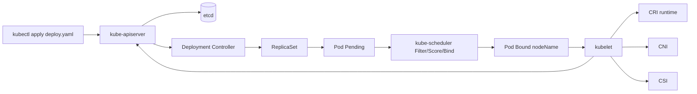
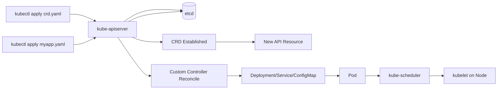
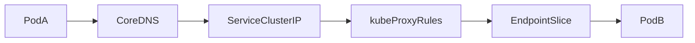
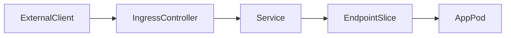
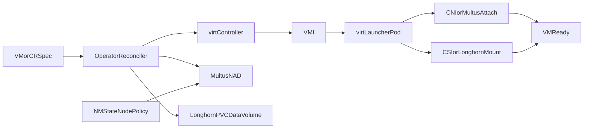
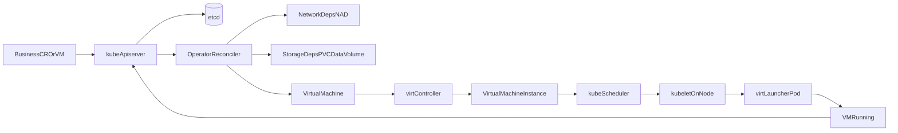

# Kubernetes 资源创建流程（标准资源 + CRD）

本文用于面试场景，回答两个核心问题：

1. 标准资源（Deployment/Pod）是如何从 YAML 变成运行中容器的？
2. CRD/CR（自定义资源）是如何被注册并生效的？

---

## 1. Kubernetes 架构速览

### 1.1 控制平面（Control Plane）

1. `kube-apiserver`：唯一 API 入口，负责认证、授权、准入、对象持久化
2. `etcd`：存储所有集群状态（声明状态 + 实际状态）
3. `kube-scheduler`：为 Pending Pod 选择合适节点
4. `kube-controller-manager`：运行各类内置控制器（Deployment、ReplicaSet、Job、Node 等）

### 1.2 节点平面（Worker Node）

1. `kubelet`：负责节点上 Pod 生命周期管理
2. `container runtime`（containerd 等）：负责镜像拉取、容器创建与运行
3. `kube-proxy`：维护 Service 转发规则（iptables/ipvs）
4. `CNI` 插件（Calico/Flannel/Cilium 等）：负责 Pod 网络
5. `CSI` 插件：负责卷挂载/卸载

> 说明：CoreDNS、Ingress Controller 通常以工作负载（Deployment）形式运行在集群里，不是每个 Node 的“基础组件”。

---

## 2. Service 与网络流量链路（补充）

这一节是对“资源创建流程”的横切补充，回答服务发现、流量转发和网络访问控制由谁负责。

### 2.1 Service：服务抽象与稳定入口

- `ClusterIP`：仅集群内访问，最常用
- `NodePort`：通过每个节点固定端口对外暴露
- `LoadBalancer`：对接云厂商 LB，对外暴露四层入口
- `ExternalName`：把 Service 映射到外部 DNS 名称

Service 自身不直接“持有”Pod，而是通过 Label Selector 选择后端 Pod。

### 2.2 EndpointSlice：Service 的后端端点集合

- 控制器会根据 Pod 标签和 Ready 状态维护 EndpointSlice
- Service 流量最终会转发到 EndpointSlice 中的可用端点
- 比旧的 Endpoints 对象更适合大规模端点场景

### 2.3 kube-proxy：节点侧转发规则维护者

- 监听 Service / EndpointSlice 变化
- 在节点上写入 `iptables/ipvs` 规则
- 让访问 Service VIP 的流量被转发到后端 Pod

### 2.4 CoreDNS：服务发现入口

- 提供 Service DNS 解析
- 常见域名：`<svc>.<ns>.svc.cluster.local`
- Pod 通常通过 Service 名称而不是 Pod IP 访问后端服务

### 2.5 Ingress 与 IngressController：七层入口路由

- `Ingress` 是路由规则对象（Host/Path/TLS）
- `IngressController` 才是执行流量转发的控制面/数据面实现
- 典型路径：外部流量 -> IngressController -> Service -> Pod

### 2.6 CNI 与 NetworkPolicy：连通性与隔离

- `CNI` 负责 Pod 网络创建和跨节点连通
- `NetworkPolicy` 定义 Pod 入站/出站访问控制（L3/L4）
- 常见策略：默认拒绝 + 按命名空间/标签白名单放行

---

## 3. 标准资源创建流程（Deployment -> ReplicaSet -> Pod）

以创建 Deployment 为例：

### Step 1：请求进入 API Server

客户端提交 YAML：

```bash
kubectl apply -f deploy.yaml
```

API Server 依次执行：

1. Authentication（你是谁）
2. Authorization（你是否有权限）
3. Admission（是否符合策略，必要时 Mutation + Validation）
4. 对象校验通过后写入 `etcd`

### Step 2：控制器 Reconcile

控制器并不是被 API Server “通知”，而是通过 `List/Watch` 感知变化：

1. Deployment Controller 看到新 Deployment，创建/更新 ReplicaSet
2. ReplicaSet Controller 保证 Pod 副本数达到期望值
3. 新创建 Pod 初始通常是 `Pending`（尚未绑定节点）

### Step 3：Scheduler 调度 Pod

Scheduler 对 Pending Pod 执行典型阶段：

1. `Filter`：过滤不满足资源、亲和性、污点容忍等条件的节点
2. `Score`：对可选节点打分
3. `Bind`：将最佳节点写入 `pod.spec.nodeName`

### Step 4：kubelet 在目标节点拉起容器

目标节点 kubelet 监听到绑定到本节点的 Pod 后：

1. 调用 CRI 拉镜像并创建容器
2. 调用 CNI 分配网络
3. 如有卷，调用 CSI 挂载
4. 持续上报 Pod/容器状态到 API Server

### Step 4.5：Pod Ready 后接入 Service 流量面（横切）

1. Pod 通过就绪探针后，控制器将其加入 EndpointSlice
2. Service 根据 Selector 关联这些后端端点
3. kube-proxy 根据 EndpointSlice 更新节点转发规则
4. 集群内客户端通过 CoreDNS 解析 Service 域名并访问后端

### Step 5：用户观测结果

```bash
kubectl get deploy,rs,pod -o wide
kubectl describe pod <pod-name>
kubectl get events --sort-by=.metadata.creationTimestamp
```

---

## 4. CRD/CR 创建流程（自定义资源）

CRD 流程分两段：**先注册类型，再创建实例**。

### 4.1 创建 CRD（注册新 Kind）

```bash
kubectl apply -f crd.yaml
kubectl get crd
kubectl describe crd <crd-name>
```

流程如下：

1. CRD 请求到达 API Server（同样经历认证、授权、准入）
2. API Server 校验 CRD 定义（group/version/names/schema）
3. 持久化到 etcd
4. `apiextensions` 完成注册后，CRD 状态变为 `Established=True`
5. 新资源端点可用：`/apis/<group>/<version>/<plural>`

验证：

```bash
kubectl api-resources | grep <kind-or-plural>
```

### 4.2 创建 CR（自定义资源实例）

```bash
kubectl apply -f myapp.yaml
kubectl get <plural> -A
kubectl get <plural> <name> -o yaml
```

流程如下：

1. CR 对象按 CRD schema 校验并存储到 etcd
2. 自定义控制器（Operator）通过 List/Watch 观察到新 CR
3. 控制器进入 Reconcile：
   - 读取 `spec`
   - 创建/更新下游标准资源（Deployment/Service/ConfigMap 等）
   - 回写 `status/conditions`

> 关键点：Scheduler/kubelet 不会直接“执行 CRD/CR”；它们执行的是控制器最终创建出来的 Pod。

---

## 5. 对象关系图（标准资源）



## 6. 对象关系图（CRD/CR）



---

## 7. 网络对象关系图（请求路径）

### 7.1 集群内访问（PodA -> Service -> PodB）



### 7.2 集群外访问（Client -> Ingress -> Service -> Pod）



---

## 8. 面试高频追问与回答要点

### Q1：APIServer 会主动通知 Controller 吗？

不会。Controller 通过 List/Watch 从 APIServer 获取变更并持续 Reconcile。

### Q2：CRD 创建后为什么还“没效果”？

CRD 只是在 API 层注册了新类型；是否产生实际业务资源，取决于是否有对应自定义控制器处理 CR。

### Q3：Pod 一直 Pending 怎么排查？

```bash
kubectl describe pod <pod-name>
kubectl get events --sort-by=.metadata.creationTimestamp
kubectl describe node <node-name>
```

重点看：资源不足、节点亲和性/污点、PVC 未绑定、镜像拉取失败等。

### Q4：Pod Ready 了但 Service 还是访问不到，先看什么？

先检查四个点：

1. Service 的 `selector` 是否匹配目标 Pod 标签
2. Pod `readinessProbe` 是否通过（未 Ready 不会进入可用端点）
3. `EndpointSlice` 是否真的出现了对应后端
4. 是否被 `NetworkPolicy`、安全组或防火墙阻断

### Q5：Service 和 Ingress 的核心区别？

- Service 解决的是服务抽象和服务内负载分发（L4 为主）
- Ingress 解决的是 HTTP/HTTPS 七层路由与统一入口（Host/Path/TLS）
- 常见组合是 `Ingress -> Service -> Pod`

## 9. Service/网络关键命令（排障清单）

```bash
# 资源面
kubectl get svc,endpoints,endpointslices -A
kubectl describe svc <service-name> -n <namespace>
kubectl get ingress -A
kubectl describe ingress <ingress-name> -n <namespace>
kubectl get netpol -A

# DNS 与连通性验证（从业务 Pod 内执行）
kubectl exec -it <pod-name> -n <namespace> -- nslookup <service-name>.<namespace>.svc.cluster.local
kubectl exec -it <pod-name> -n <namespace> -- curl -sv http://<service-name>.<namespace>.svc.cluster.local

# 事件与后端端点
kubectl get events -n <namespace> --sort-by=.metadata.creationTimestamp
kubectl get endpointslices -n <namespace> -l kubernetes.io/service-name=<service-name> -o yaml
```

---

## 10. 虚拟机创建流程（KubeVirt 面试版）

这一节单独回答：在 Kubernetes 中，虚拟机（VM）如何从声明变成运行中的实例（VMI）。

### 10.0 一句话主线（归纳版）

**提交 VM/CR -> API Server 持久化 -> Operator/KubeVirt 控制器 Reconcile -> 网络与存储依赖就绪 -> 生成 VMI -> 节点拉起 virt-launcher -> 状态回写为 Running。**

### 10.1 详细主线（1 到 N）

1. **提交声明**
   - **步骤**：通过 `kubectl apply -f vm.yaml`、GitOps 或业务 API 提交 `VirtualMachine`/上层 CR。
   - **知识点**：这是“声明式期望状态”，不是立即创建成功；只表达“我想要什么”。
   - **关键组件**：`kube-apiserver`（接收请求入口）。
   - **代码/对象**：`apiVersion: kubevirt.io/v1`、`kind: VirtualMachine`、`spec.template.spec.domain`、`spec.template.spec.networks`、`spec.dataVolumeTemplates`。

2. **准入持久化**
   - **步骤**：API Server 完成认证、授权、准入（schema/admission）后，把对象写入 etcd。
   - **知识点**：写入 etcd 代表“期望状态已被集群接受”，不是“虚机已运行”。
   - **关键组件**：`kube-apiserver`、`etcd`、Admission Webhook。
   - **代码/命令**：`kubectl get vm <name> -o yaml`（可看到对象已存在）。

3. **控制器接管**
   - **步骤**：业务 Operator 与 KubeVirt 控制器通过 Watch 发现对象变化，进入 Reconcile。
   - **知识点**：Reconcile 是幂等循环，控制器会不断把“现状”拉向“期望”。
   - **关键组件**：`Operator/Reconciler`、`virt-controller`。
   - **代码/实现点**：controller-runtime 常见骨架 `Reconcile(ctx, req)` + `client.Get/List/Create/Update`。

4. **初始化保护**
   - **步骤**：控制器做参数校验、默认值补齐，并添加 Finalizer。
   - **知识点**：Finalizer 保证删除时先清理子资源（网络、卷、VMI），避免资源泄漏。
   - **关键组件**：业务控制器、Kubernetes GC/Finalizer 机制。
   - **代码/对象**：`metadata.finalizers`、`controllerutil.AddFinalizer(...)`。

5. **准备依赖（网络 + 存储）**
   - **步骤**：网络侧准备 `NMState + Multus + NAD`；存储侧准备 `Longhorn + PVC/DataVolume + CSI`。
   - **知识点**：VM 能否启动，常卡在“依赖未就绪”而不是 VM 对象本身。
   - **关键组件**：`nmstate-operator`、`multus`、`longhorn`、`csi-provisioner`。
   - **代码/对象**：`NetworkAttachmentDefinition`、`PersistentVolumeClaim`、`DataVolume`。

6. **未就绪重试**
   - **步骤**：若卷未 Bound、NAD 不可用、节点网络策略未生效，返回 Requeue/RequeueAfter。
   - **知识点**：Kubernetes 是最终一致性系统；重试是正常收敛手段，不是异常设计。
   - **关键组件**：业务控制器重试队列、工作队列（workqueue）。
   - **代码/实现点**：`return ctrl.Result{RequeueAfter: ...}, nil`。

7. **创建运行实例**
   - **步骤**：依赖 Ready 后创建/更新 VM；KubeVirt 生成 VMI；scheduler 完成节点绑定。
   - **知识点**：`VM` 是声明对象，`VMI` 是运行时实例；真正调度的是运行实例。
   - **关键组件**：`virt-controller`、`kube-scheduler`。
   - **代码/命令**：`kubectl get vm,vmi -n <ns>`（观察 VM 到 VMI 的推进）。

8. **节点落地与状态回写**
   - **步骤**：kubelet 拉起 `virt-launcher`，CNI/Multus 接网，CSI/Longhorn 挂盘；随后回写 phase/conditions。
   - **知识点**：面试可强调“运行态判断看 conditions，不只看 phase”。
   - **关键组件**：`kubelet`、`container runtime`、`virt-handler`、`CNI/CSI`。
   - **代码/命令**：`kubectl get pod -A | grep virt-launcher`、`kubectl describe vmi <name>`、`kubectl get events -n <ns> --sort-by=.metadata.creationTimestamp`。

### 10.2 组件负责哪些流程

1. `kube-apiserver`
   - 负责接收 VM/CR 请求、认证鉴权、准入校验、写入 etcd
   - 所在阶段：请求入口与持久化
2. `etcd`
   - 负责保存资源 `spec/status`
   - 所在阶段：状态存储
3. `Operator/Reconciler`（你的业务控制器）
   - 负责按依赖顺序编排资源、检查就绪、失败重试（Requeue）、回写 Conditions
   - 所在阶段：编排与收敛
4. `virt-controller`（KubeVirt 控制器）
   - 负责 VM/VMI 生命周期推进
   - 所在阶段：虚机控制面
5. `kube-scheduler`
   - 负责把承载虚机的运行单元调度到合适节点
   - 所在阶段：调度
6. `kubelet + container runtime`
   - 负责在目标节点启动 `virt-launcher` Pod，拉镜像并运行
   - 所在阶段：节点执行
7. `CNI/Multus`
   - 负责 VM 对应网络接入（默认网络/附加网络）
   - 所在阶段：网络就绪
8. `CSI + 存储控制器`
   - 负责卷创建、绑定、挂载（PVC/DataVolume 等）
   - 所在阶段：存储就绪

### 10.2.1 扩展组件补充知识点（KubeVirt / Multus / NMState / Longhorn）

1. `KubeVirt`
   - `virt-controller`：负责推进 VM/VMI 生命周期，是“虚机控制面”的核心控制器
   - `virt-handler`：运行在节点侧，负责节点与虚机运行时交互
   - `virt-launcher`：承载 VM 实际运行实例（qemu/libvirt）
   - 对流程影响：决定从声明态 VM 到运行态 VMI 的生命周期收敛速度与稳定性

2. `Multus`
   - 多网络元插件，负责把附加网络（NAD）注入到 VM 对应运行单元
   - 对流程影响：影响“附加网卡是否能成功下发”，常见于多网卡、业务隔离网络场景

3. `NMState`
   - 节点网络声明式管理（桥接、VLAN、Bond）
   - 对流程影响：是多网络能力的“节点先决条件”；节点网络未准备好，Multus/NAD 即使存在也可能无法生效

4. `Longhorn`
   - 分布式块存储，常与 PVC/DataVolume 配合为 VM 提供系统盘/数据盘
   - 对流程影响：决定卷的供应、绑定、挂载与恢复链路；卷未就绪会阻塞 VM 启动

### 10.3 典型 8 步创建流程

1. 用户提交 VM 或上层 CR（如业务自定义资源）
2. API Server 完成准入并写入 etcd
3. 业务控制器 Watch 到事件，进入 Reconcile
4. 添加 Finalizer，做参数校验与默认化
5. 先处理依赖：网络对象（如 NAD）与存储对象（PVC/DataVolume）
6. 依赖未就绪则 Requeue，等待下一轮协调
7. 依赖就绪后创建/更新 VM，由 KubeVirt 生成 VMI 并推进运行
8. 控制器持续回写 `phase/conditions`，直到 `Running` 或 `Error`

### 10.3.1 扩展版时序（强调网络与存储先决依赖）

1. NMState 先确保节点网络拓扑满足要求（桥接/VLAN/Bond）
2. Multus + NAD 准备附加网络定义
3. Longhorn 供应并绑定卷（PVC/DataVolume）
4. KubeVirt 创建 VM -> VMI -> virt-launcher
5. kubelet + CNI/CSI 完成网络与存储接入
6. 控制器回写状态到 `Running/Ready`

### 10.3.2 组件协作关系图（扩展）



### 10.4 对象关系图（VM -> VMI -> 节点运行）



### 10.5 关键状态与判断点

- `phase`：`Pending -> Creating -> Running`（或 `Error/Stopped`）
- `conditions`：建议至少有 `NetworksReady`、`VolumesReady`、`Ready`
- 排障时优先看 `conditions`，它能直接说明卡在哪个依赖阶段

### 10.6 关键命令（创建与排障）

```bash
# 虚机主对象
kubectl get vm,vmi -A
kubectl describe vm <vm-name> -n <namespace>
kubectl describe vmi <vmi-name> -n <namespace>

# 承载虚机运行的 Pod
kubectl get pod -A | grep virt-launcher
kubectl describe pod <virt-launcher-pod> -n <namespace>

# 网络与存储依赖
kubectl get network-attachment-definitions -A
kubectl get pvc,dv -A

# 事件与收敛过程
kubectl get events -n <namespace> --sort-by=.metadata.creationTimestamp
```

### 10.7 面试口述要点（30 秒）

「虚拟机创建本质也是声明式收敛。请求先到 API Server 并写入 etcd，业务 Operator watch 到后进入 Reconcile，先处理网络和存储等前置依赖，没就绪就 Requeue。依赖满足后创建 VM，KubeVirt 再生成 VMI 并调度到节点，由 kubelet 启动 virt-launcher 实际运行虚机。最后控制器把 phase 和 conditions 回写，直到 Running 或 Error。」

### 10.8 扩展组件排障要点（KubeVirt / Multus / NMState / Longhorn）

1. `KubeVirt`：VMI Pending、启动失败、迁移异常
   - 检查命令：
   ```bash
   kubectl get vm,vmi -A
   kubectl describe vmi <vmi-name> -n <namespace>
   kubectl get pods -n kubevirt
   ```

2. `Multus`：附加网卡失败、NAD 不存在、网络注入异常
   - 检查命令：
   ```bash
   kubectl get network-attachment-definitions -A
   kubectl describe pod <virt-launcher-pod> -n <namespace>
   ```

3. `NMState`：节点网络策略未下发、桥/VLAN 未生效
   - 检查命令：
   ```bash
   kubectl get nncp,nns -A
   kubectl describe nncp <nncp-name>
   kubectl describe nns <node-name>
   ```

4. `Longhorn`：卷未绑定、卷 attach/mount 失败、副本异常
   - 检查命令：
   ```bash
   kubectl get pvc,pv -A
   kubectl get pods -n longhorn-system
   kubectl describe pvc <pvc-name> -n <namespace>
   ```
