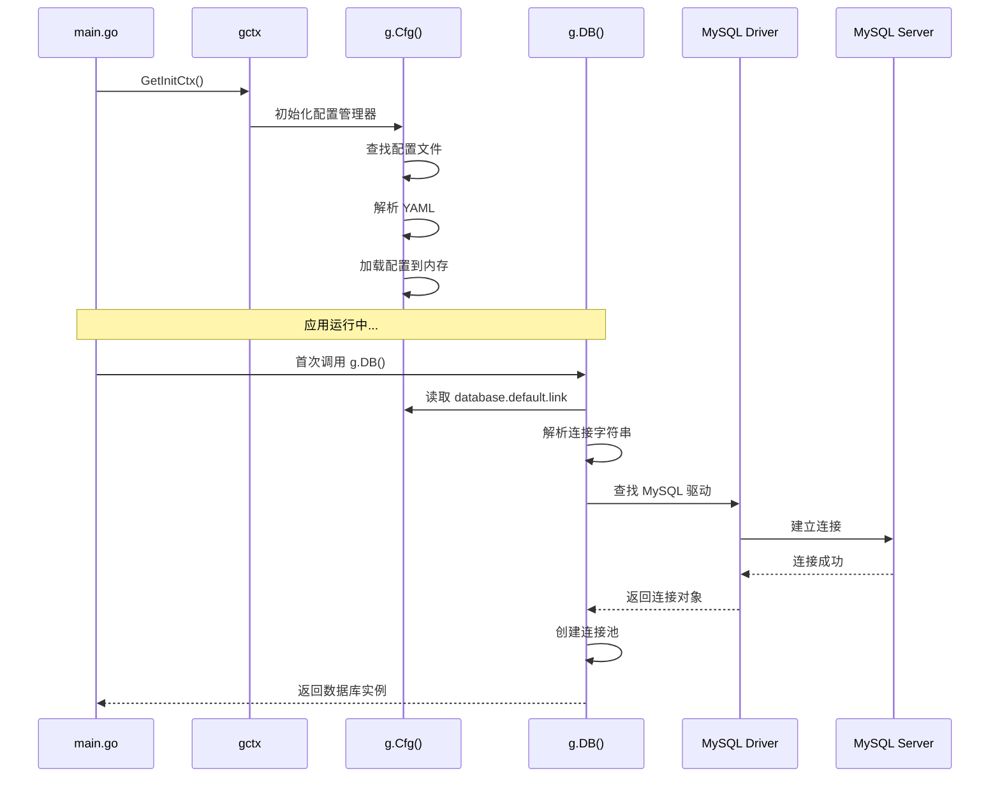

# 配置和数据库加载流程文档

## 概述

本文档详细说明 GoFrame 项目如何解析配置文件并加载数据库连接。

## 配置文件位置

### 默认配置文件
- **路径**: `manifest/config/config.yaml`
- **格式**: YAML

### 配置文件内容结构

```yaml
# 服务器配置
server:
  address:     ":8000"
  openapiPath: "/api.json"
  swaggerPath: "/swagger"

# 日志配置
logger:
  level : "all"
  stdout: true

# 数据库配置
database:
  default:
    link: "mysql:username:password@tcp(127.0.0.1:3306)/dbname?param=value"
```

## 配置加载机制

### 1. GoFrame 自动配置加载

GoFrame 框架在初始化时会自动查找并加载配置文件，加载顺序如下：

```
1. 命令行参数 -c 指定的配置文件路径
   ↓ (如果未指定)
2. 环境变量 GF_CFG_FILE 指定的配置文件路径
   ↓ (如果未指定)
3. 默认配置文件路径（按优先级）:
   - manifest/config/config.yaml
   - config/config.yaml
   - config.yaml
```

### 2. 配置加载时机

配置加载发生在 GoFrame 框架初始化时，具体流程：

```go
// main.go
func main() {
    cmd.Main.Run(gctx.GetInitCtx())  // ← 这里会触发配置加载
}
```

**详细流程**:

```
1. gctx.GetInitCtx() 创建初始化上下文
   ↓
2. GoFrame 内部初始化 gcfg (配置管理器)
   ↓
3. 自动查找配置文件 (按上述优先级)
   ↓
4. 解析 YAML 文件
   ↓
5. 加载到内存中的配置对象
   ↓
6. 后续通过 g.Cfg() 访问配置
```

### 3. 配置访问方式

GoFrame 提供了多种方式访问配置：

```go
// 方式1: 使用 g.Cfg() 全局函数
g.Cfg().MustGet("database.default.link")

// 方式2: 使用配置组
g.Cfg().MustGet("database.default")

// 方式3: 使用结构体绑定（推荐）
type DatabaseConfig struct {
    Link string `yaml:"link"`
}
var dbConfig DatabaseConfig
g.Cfg().MustGet("database.default", &dbConfig)
```

## 数据库连接加载机制

### 1. 数据库配置解析

配置文件中的数据库配置：

```yaml
database:
  default:  # 数据库连接组名称
    link: "mysql:username:password@tcp(127.0.0.1:3306)/dbname?param=value"
```

**连接字符串格式**:
```
type:username:password@protocol(host:port)/dbname?param1=value1&param2=value2
```

**组成部分**:
- `type`: 数据库类型 (mysql, pgsql, sqlite, mssql, oracle)
- `username`: 数据库用户名
- `password`: 数据库密码（特殊字符需要URL编码）
- `protocol`: 连接协议 (tcp, unix)
- `host:port`: 数据库地址和端口
- `dbname`: 数据库名称
- `param=value`: 连接参数（可选）

### 2. 数据库驱动注册

**重要**: 使用 MySQL 数据库时，需要在 `main.go` 中导入 MySQL 驱动：

```go
import (
    _ "github.com/gogf/gf/contrib/drivers/mysql/v2"  // MySQL驱动
    // 或者
    _ "github.com/go-sql-driver/mysql"  // 标准MySQL驱动
)
```

### 3. 数据库连接初始化

数据库连接采用**懒加载（Lazy Loading）**机制：

```
1. 首次调用 g.DB() 时触发
   ↓
2. 读取配置 database.default.link
   ↓
3. 解析连接字符串
   ↓
4. 根据 type 查找已注册的驱动
   ↓
5. 创建数据库连接池
   ↓
6. 缓存连接对象
   ↓
7. 返回数据库实例
```

**代码示例**:

```go
// internal/dao/user.go
func (dao *userDao) GetById(ctx context.Context, id uint) (user *entity.User, err error) {
    // 首次调用 g.DB() 时会自动初始化数据库连接
    err = g.DB().Model("users").Ctx(ctx).Where("id", id).Scan(&user)
    return
}
```

### 4. 数据库连接池配置

GoFrame 支持连接池配置（在配置文件中）：

```yaml
database:
  default:
    link: "mysql:username:password@tcp(127.0.0.1:3306)/dbname"
    maxIdle: 10        # 最大空闲连接数
    maxOpen: 100       # 最大打开连接数
    maxLifetime: "30s" # 连接最大生存时间
    charset: "utf8mb4" # 字符集
```

## 完整加载流程图



## 关键代码位置

### 1. 配置文件
- **位置**: `manifest/config/config.yaml`
- **作用**: 存储所有配置信息

### 2. 数据库使用
- **位置**: `internal/dao/user.go`
- **方式**: `g.DB().Model("table_name")`

### 3. 配置访问
- **全局函数**: `g.Cfg()` - 访问配置
- **数据库函数**: `g.DB()` - 访问数据库（自动初始化）

## 常见问题

### 1. 密码包含特殊字符

如果密码包含特殊字符（如 `!`, `@`, `#`, `%` 等），需要进行 URL 编码：

```
原始密码: Liujianfeng1234!
URL编码:  Liujianfeng1234%21

连接字符串:
mysql:root:Liujianfeng1234%21@tcp(127.0.0.1:3306)/test
```

**常见特殊字符编码**:
- `!` → `%21`
- `@` → `%40`
- `#` → `%23`
- `%` → `%25`
- `&` → `%26`
- `=` → `%3D`

### 2. 找不到数据库驱动

**错误信息**:
```
cannot find database driver for specified database type "mysql"
```

**解决方法**:
在 `main.go` 中导入 MySQL 驱动：

```go
import (
    _ "github.com/gogf/gf/contrib/drivers/mysql/v2"
    // 或者
    _ "github.com/go-sql-driver/mysql"
)
```

然后运行：
```bash
go mod tidy
go run main.go
```

### 3. 配置文件未找到

**可能原因**:
1. 配置文件路径不正确
2. 工作目录不对

**解决方法**:
- 确保配置文件在 `manifest/config/config.yaml`
- 或者通过环境变量指定: `export GF_CFG_FILE=/path/to/config.yaml`
- 或者通过命令行参数: `go run main.go -c /path/to/config.yaml`

### 4. 数据库连接失败

**检查项**:
1. 数据库服务是否启动
2. 连接字符串格式是否正确
3. 用户名密码是否正确
4. 网络是否可达
5. 防火墙是否允许连接

## 配置热更新

GoFrame 支持配置文件热更新（需要启用文件监控）：

```yaml
# 在配置文件中启用
cfgfile:
  file: "manifest/config/config.yaml"
  watch: true  # 启用文件监控
```

## 多环境配置

可以通过不同方式加载不同环境的配置：

### 方式1: 环境变量指定
```bash
export GF_CFG_FILE=manifest/config/config.prod.yaml
go run main.go
```

### 方式2: 命令行参数
```bash
go run main.go -c manifest/config/config.prod.yaml
```

### 方式3: 多个配置组
```yaml
database:
  default:
    link: "mysql:user:pass@tcp(localhost:3306)/dev"
  prod:
    link: "mysql:user:pass@tcp(prod-server:3306)/prod"
```

使用时：
```go
g.DB("prod")  // 使用 prod 配置组
```

## 总结

1. **配置加载**: GoFrame 在初始化时自动加载配置文件
2. **数据库连接**: 采用懒加载，首次调用 `g.DB()` 时初始化
3. **驱动注册**: 需要在 `main.go` 中导入对应的数据库驱动
4. **连接字符串**: 密码中的特殊字符需要 URL 编码
5. **配置访问**: 通过 `g.Cfg()` 访问配置，通过 `g.DB()` 访问数据库

