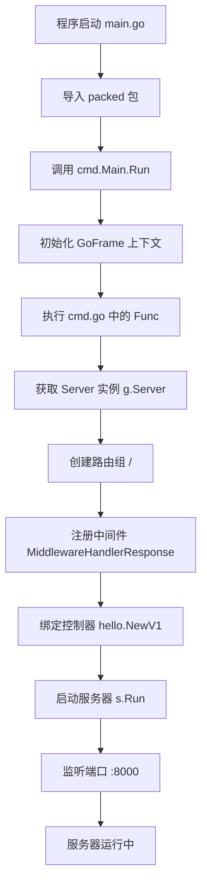
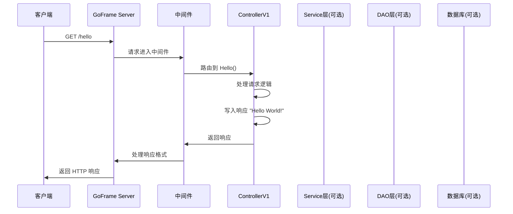
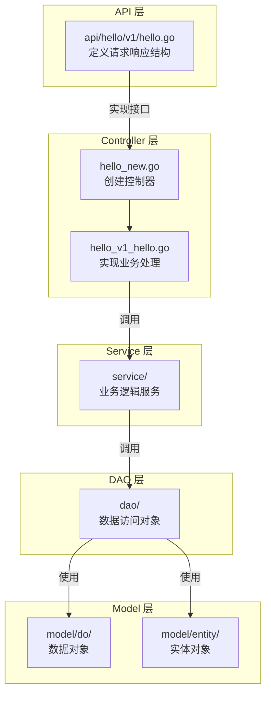
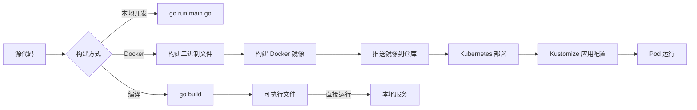
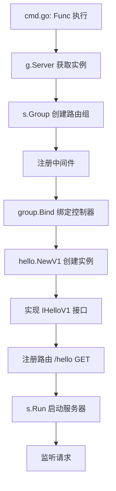
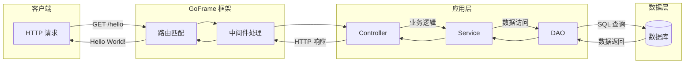
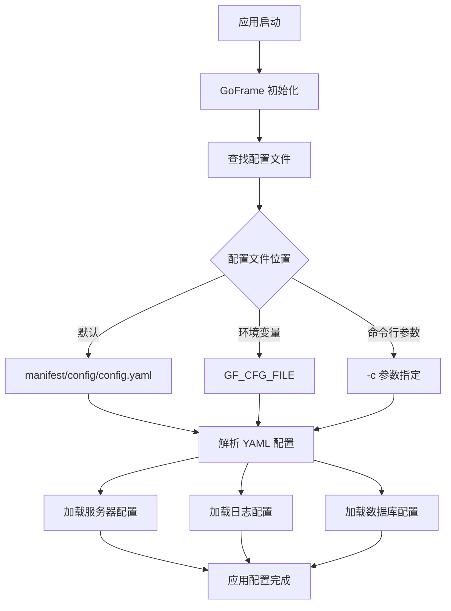
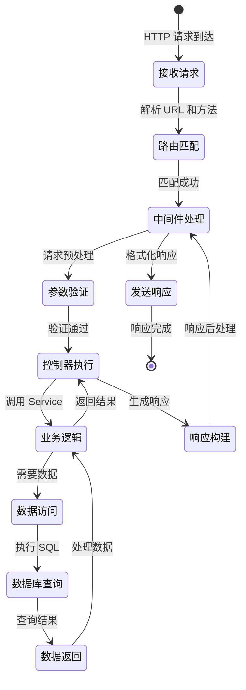

# 项目流程图

## 1. 应用启动流程图

```mermaid
graph TD
    A[程序启动 main.go] --> B[导入 packed 包]
    B --> C[调用 cmd.Main.Run]
    C --> D[初始化 GoFrame 上下文]
    D --> E[执行 cmd.go 中的 Func]
    E --> F[获取 Server 实例 g.Server]
    F --> G[创建路由组 /]
    G --> H[注册中间件 MiddlewareHandlerResponse]
    H --> I[绑定控制器 hello.NewV1]
    I --> J[启动服务器 s.Run]
    J --> K[监听端口 :8000]
    K --> L[服务器运行中]
```

## 2. HTTP 请求处理流程图

```mermaid
sequenceDiagram
    participant Client as 客户端
    participant Server as GoFrame Server
    participant Middleware as 中间件
    participant Controller as ControllerV1
    participant Service as Service层(可选)
    participant DAO as DAO层(可选)
    participant DB as 数据库(可选)

    Client->>Server: GET /hello
    Server->>Middleware: 请求进入中间件
    Middleware->>Controller: 路由到 Hello()
    Controller->>Controller: 处理请求逻辑
    Controller->>Controller: 写入响应 "Hello World!"
    Controller->>Middleware: 返回响应
    Middleware->>Server: 处理响应格式
    Server->>Client: 返回 HTTP 响应
```

## 3. 代码架构层次图

```mermaid
graph TB
    subgraph "API 层"
        A1[api/hello/v1/hello.go<br/>定义请求响应结构]
    end
    
    subgraph "Controller 层"
        C1[hello_new.go<br/>创建控制器]
        C2[hello_v1_hello.go<br/>实现业务处理]
    end
    
    subgraph "Service 层"
        S1[service/<br/>业务逻辑服务]
    end
    
    subgraph "DAO 层"
        D1[dao/<br/>数据访问对象]
    end
    
    subgraph "Model 层"
        M1[model/do/<br/>数据对象]
        M2[model/entity/<br/>实体对象]
    end
    
    A1 -->|实现接口| C1
    C1 --> C2
    C2 -->|调用| S1
    S1 -->|调用| D1
    D1 -->|使用| M1
    D1 -->|使用| M2
```

## 4. 项目构建和部署流程图

```mermaid
graph LR
    A[源代码] --> B{构建方式}
    B -->|本地开发| C[go run main.go]
    B -->|编译| D[go build]
    B -->|Docker| E[构建二进制文件]
    E --> F[构建 Docker 镜像]
    F --> G[推送镜像到仓库]
    G --> H[Kubernetes 部署]
    H --> I[Kustomize 应用配置]
    I --> J[Pod 运行]
    
    D --> K[可执行文件]
    K -->|直接运行| L[本地服务]
```

## 5. 路由注册流程图

```mermaid
graph TD
    A[cmd.go: Func 执行] --> B[g.Server 获取实例]
    B --> C[s.Group 创建路由组]
    C --> D[注册中间件]
    D --> E[group.Bind 绑定控制器]
    E --> F[hello.NewV1 创建实例]
    F --> G[实现 IHelloV1 接口]
    G --> H[注册路由 /hello GET]
    H --> I[s.Run 启动服务器]
    I --> J[监听请求]
```

## 6. 数据流向图

```mermaid
flowchart LR
    subgraph "客户端"
        A[HTTP 请求]
    end
    
    subgraph "GoFrame 框架"
        B[路由匹配]
        C[中间件处理]
    end
    
    subgraph "应用层"
        D[Controller]
        E[Service]
        F[DAO]
    end
    
    subgraph "数据层"
        G[(数据库)]
    end
    
    A -->|GET /hello| B
    B --> C
    C --> D
    D -->|业务逻辑| E
    E -->|数据访问| F
    F -->|SQL 查询| G
    G -->|数据返回| F
    F --> E
    E --> D
    D -->|HTTP 响应| C
    C --> B
    B -->|Hello World!| A
```

## 7. 配置文件加载流程

```mermaid
graph TD
    A[应用启动] --> B[GoFrame 初始化]
    B --> C[查找配置文件]
    C --> D{配置文件位置}
    D -->|默认| E[manifest/config/config.yaml]
    D -->|环境变量| F[GF_CFG_FILE]
    D -->|命令行参数| G[-c 参数指定]
    E --> H[解析 YAML 配置]
    F --> H
    G --> H
    H --> I[加载服务器配置]
    H --> J[加载日志配置]
    H --> K[加载数据库配置]
    I --> L[应用配置完成]
    J --> L
    K --> L
```

## 8. 完整请求生命周期

```mermaid
stateDiagram-v2
    [*] --> 接收请求: HTTP 请求到达
    接收请求 --> 路由匹配: 解析 URL 和方法
    路由匹配 --> 中间件处理: 匹配成功
    中间件处理 --> 参数验证: 请求预处理
    参数验证 --> 控制器执行: 验证通过
    控制器执行 --> 业务逻辑: 调用 Service
    业务逻辑 --> 数据访问: 需要数据
    数据访问 --> 数据库查询: 执行 SQL
    数据库查询 --> 数据返回: 查询结果
    数据返回 --> 业务逻辑: 处理数据
    业务逻辑 --> 控制器执行: 返回结果
    控制器执行 --> 响应构建: 生成响应
    响应构建 --> 中间件处理: 响应后处理
    中间件处理 --> 发送响应: 格式化响应
    发送响应 --> [*]: 响应完成
```

