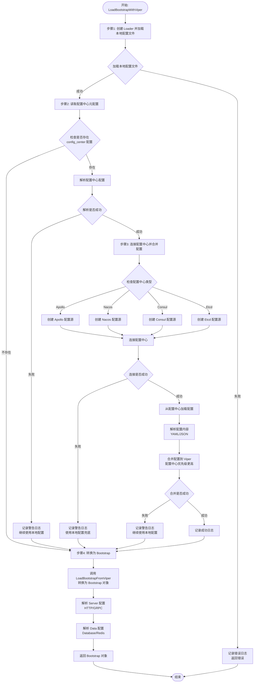

# 配置加载流程文档 - LoadBootstrapWithViper

## 概述

`LoadBootstrapWithViper` 是使用 Viper 作为配置管理器的配置加载函数，支持从本地配置文件和配置中心加载配置，并将配置合并后转换为 Kratos Bootstrap 配置对象。

**函数签名：**
```go
func LoadBootstrapWithViper(configPath string, logger log.Logger) (*conf.Bootstrap, error)
```

**位置：** `internal/config/loader.go`

## 核心特性

- ✅ 支持本地配置文件加载（YAML 格式）
- ✅ 支持配置中心（Apollo、Nacos、Consul、Etcd）
- ✅ 配置优先级：配置中心 > 本地文件
- ✅ 配置中心连接失败时自动降级到本地配置（兜底机制）
- ✅ 支持环境变量覆盖
- ✅ 自动转换为 Kratos Bootstrap 配置对象

## 详细流程

### 流程图



### 步骤详解

#### 步骤 1: 使用 Viper 加载本地配置文件

**代码位置：** `internal/config/loader.go:119-125`

```go
loader := NewLoader()
if err := loader.LoadFromFile(configPath); err != nil {
    // 记录错误并返回
    return nil, fmt.Errorf("failed to load local config file: %w", err)
}
```

**功能说明：**
- 创建新的 `Loader` 实例（内部使用 Viper）
- 调用 `LoadFromFile` 加载本地配置文件
- 支持目录路径（自动查找 `config.yaml` 或 `config.{env}.yaml`）
- 支持直接文件路径

**关键函数：**
- `NewLoader()`: 创建配置加载器，初始化 Viper 实例
- `LoadFromFile()`: 从文件或目录加载配置

#### 步骤 2: 从本地配置中读取配置中心配置（元配置）

**代码位置：** `internal/config/loader.go:127-137`

```go
var configCenter conf.ConfigCenter
if loader.IsSet("config_center") {
    if err := loader.UnmarshalKey("config_center", &configCenter); err != nil {
        // 记录警告，但不中断流程
        logger.Log(log.LevelWarn, "msg", "failed to unmarshal config center config", "err", err)
    }
}
```

**功能说明：**
- 检查本地配置中是否存在 `config_center` 配置项
- 如果存在，解析配置中心连接信息（Apollo、Nacos、Consul、Etcd）
- 解析失败时记录警告，但不中断流程（继续使用本地配置）

**配置中心类型：**
- Apollo: `config_center.apollo`
- Nacos: `config_center.nacos`
- Consul: `config_center.consul`
- Etcd: `config_center.etcd`

#### 步骤 3: 连接配置中心并合并配置到 Viper

**代码位置：** `internal/config/loader.go:139-166`

**3.1 创建配置中心源**

```go
if configCenter.Apollo != nil || configCenter.Nacos != nil ||
    configCenter.Consul != nil || configCenter.Etcd != nil {
    configCenterSource, err := NewConfigCenterSource(&configCenter)
    // ...
}
```

**功能说明：**
- 根据配置中心类型创建对应的配置源
- 支持多种配置中心（Apollo、Nacos、Consul、Etcd）
- 连接失败时记录警告，但不中断流程（兜底机制）

**3.2 合并配置到 Viper**

```go
if err := mergeConfigCenterToViper(loader.Viper(), configCenterSource); err != nil {
    // 记录警告，但不中断流程
    logger.Log(log.LevelWarn, "msg", "failed to merge config center config", "err", err)
}
```

**功能说明：**
- 从配置中心加载配置数据
- 解析配置内容（支持 YAML、JSON 格式）
- 将配置合并到 Viper 实例中
- **配置优先级：配置中心的配置会覆盖本地配置**

**关键函数：**
- `NewConfigCenterSource()`: 根据配置创建配置中心源
- `mergeConfigCenterToViper()`: 将配置中心配置合并到 Viper

**配置合并逻辑：**

```go
// mergeConfigCenterToViper 内部流程
1. 从配置中心源加载配置 (source.Load())
2. 遍历配置项 (KeyValue)
3. 根据格式解析配置 (YAML/JSON)
4. 合并到 Viper (v.MergeConfigMap())
```

#### 步骤 4: 转换为 Bootstrap

**代码位置：** `internal/config/loader.go:171`

```go
return LoadBootstrapFromViper(loader.Viper())
```

**功能说明：**
- 将合并后的 Viper 配置转换为 Kratos Bootstrap 配置对象
- 解析 Server 配置（HTTP、GRPC）
- 解析 Data 配置（Database、Redis）
- 返回完整的 Bootstrap 对象

**关键函数：**
- `LoadBootstrapFromViper()`: 从 Viper 转换为 Bootstrap 对象

**转换逻辑：**

```go
// LoadBootstrapFromViper 内部流程
1. 检查并解析 server 配置
   - server.http (网络、地址、超时)
   - server.grpc (网络、地址、超时)
2. 检查并解析 data 配置
   - data.database (驱动、数据源)
   - data.redis (网络、地址、超时)
3. 构建并返回 Bootstrap 对象
```

## 配置优先级

配置的优先级顺序（从高到低）：

1. **配置中心配置** - 最高优先级
2. **本地配置文件** - 基础配置
3. **环境变量** - 通过 `SRE_*` 前缀覆盖
4. **默认值** - 代码中设置的默认值

**合并规则：**
- 配置中心的配置会覆盖本地配置文件中相同键的值
- 使用 Viper 的 `MergeConfigMap` 方法进行合并
- 后合并的配置会覆盖先合并的配置

## 错误处理机制

### 兜底机制

配置加载采用**优雅降级**策略：

1. **本地配置文件加载失败** → 直接返回错误（必须成功）
2. **配置中心连接失败** → 记录警告，继续使用本地配置
3. **配置中心配置解析失败** → 记录警告，继续使用本地配置
4. **配置合并失败** → 记录警告，继续使用本地配置

### 日志级别

- **ERROR**: 本地配置文件加载失败（必须成功）
- **WARN**: 配置中心相关操作失败（可降级）
- **INFO**: 配置中心连接成功

## 配置中心支持

### Apollo

```yaml
config_center:
  apollo:
    ip: "http://apollo-config-service:8080"
    app_id: "sre"
    cluster: "default"
    namespace: "application"
```

### Nacos

```yaml
config_center:
  nacos:
    endpoints:
      - "127.0.0.1:8848"
    namespace: "public"
    group: "DEFAULT_GROUP"
    data_id: "sre-config"
    username: "nacos"
    password: "nacos"
```

### Consul

```yaml
config_center:
  consul:
    address: "127.0.0.1:8500"
    scheme: "http"
    datacenter: "dc1"
    prefix: "sre/config"
```

### Etcd

```yaml
config_center:
  etcd:
    endpoints:
      - "127.0.0.1:2379"
    timeout: 5
    prefix: "/sre/config"
```

## 使用示例

```go
import (
    "sre/internal/config"
    "github.com/go-kratos/kratos/v2/log"
)

// 加载配置
bootstrap, err := config.LoadBootstrapWithViper("configs/config.yaml", logger)
if err != nil {
    log.Fatal(err)
}

// 使用配置
httpAddr := bootstrap.Server.Http.Addr
dbSource := bootstrap.Data.Database.Source
```

## 相关函数

### 核心函数

- `LoadBootstrapWithViper()`: 主入口函数
- `NewLoader()`: 创建配置加载器
- `LoadFromFile()`: 加载本地配置文件
- `NewConfigCenterSource()`: 创建配置中心源
- `mergeConfigCenterToViper()`: 合并配置到 Viper
- `LoadBootstrapFromViper()`: 转换为 Bootstrap

### 辅助函数

- `getConfigCenterType()`: 获取配置中心类型（用于日志）
- `parseDuration()`: 解析 duration 字符串

## 注意事项

1. **本地配置文件必须存在**：如果本地配置文件加载失败，整个流程会失败
2. **配置中心是可选的**：即使配置中心连接失败，也会继续使用本地配置
3. **配置格式支持**：配置中心支持 YAML 和 JSON 格式，TOML 格式暂不支持
4. **环境变量**：支持通过 `SRE_*` 前缀的环境变量覆盖配置
5. **配置优先级**：配置中心的配置会覆盖本地配置，确保远程配置优先

## 流程图说明

流程图展示了 `LoadBootstrapWithViper` 的完整执行流程，包括：

- ✅ 本地配置文件加载
- ✅ 配置中心元配置读取
- ✅ 配置中心连接和配置合并
- ✅ 错误处理和兜底机制
- ✅ Bootstrap 对象转换

所有关键决策点和错误处理路径都在流程图中清晰标注。

