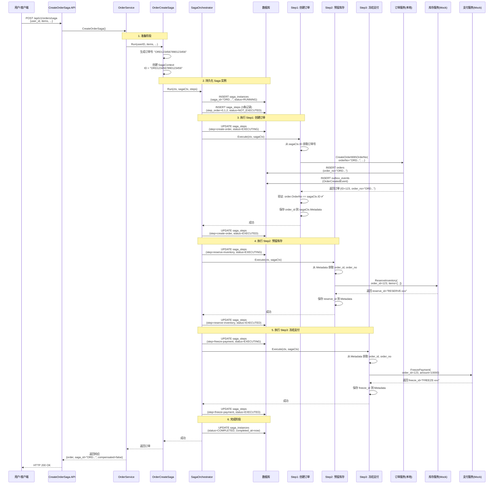
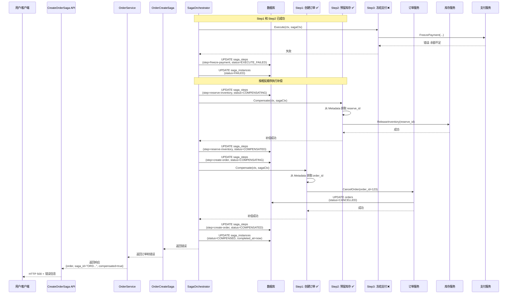

# 当前 Saga 流程详解

本文档详细说明当前实现后的 Saga 订单创建流程，包括成功场景和失败补偿场景。

## 流程概览

```
用户请求 → Service 层 → OrderCreateSaga → SagaOrchestrator → 3个步骤 → 返回结果
```

## 完整流程图

### 成功流程



### 失败补偿流程（Step3 失败）



## 详细步骤说明

### 阶段 1: API 调用

**请求**:
```http
POST /api/v1/orders/saga
Content-Type: application/json

{
  "user_id": 1,
  "currency": "CNY",
  "description": "测试订单",
  "items": [
    {
      "product_id": 1,
      "quantity": 2,
      "price": 5000
    }
  ]
}
```

**Service 层处理**:
```go
// internal/service/order.go
func (s *OrderService) CreateOrderSaga(...) {
    // 1. 转换请求参数
    // 2. 调用 OrderCreateSaga.Run()
    // 3. 返回响应
}
```

### 阶段 2: Saga 初始化

**代码位置**: `internal/biz/order_saga.go`

```go
func (s *OrderCreateSaga) Run(...) {
    // 1. 生成订单号（作为 Saga ID）
    orderNo := s.uc.GenerateOrderNo()  // "ORD1234567890123456"
    
    // 2. 创建 SagaContext
    sagaCtx := &SagaContext{
        ID:        orderNo,  // Saga ID = 订单号
        Type:      "order.create",
        Metadata:  map[string]string{"user_id": "1"},
        StartedAt: time.Now(),
    }
    
    // 3. 定义 3 个步骤
    steps := []SagaStep{
        &orderCreateStep{orderNo: orderNo, ...},  // Step1
        NewInventoryReserveStep(...),              // Step2
        NewPaymentFreezeStep(...),                 // Step3
    }
    
    // 4. 调用 SagaOrchestrator
    return s.saga.Run(ctx, sagaCtx, steps)
}
```

**关键点**:
- ✅ 订单号在 Saga 开始前生成
- ✅ Saga ID = 订单号
- ✅ 订单号传递给 `orderCreateStep`

### 阶段 3: Saga 持久化

**代码位置**: `internal/biz/saga.go`

```go
func (o *persistentSagaOrchestrator) Run(...) {
    // 1. 创建 Saga 实例记录
    instance := &SagaInstance{
        SagaID:    sagaCtx.ID,  // "ORD1234567890123456"
        SagaType:  "order.create",
        Status:    SagaInstanceStatusRunning,
        Metadata:  sagaCtx.Metadata,
        StartedAt: sagaCtx.StartedAt,
    }
    o.instanceRepo.Create(ctx, instance)
    
    // 2. 创建步骤记录
    stepNames := []string{"create-order", "reserve-inventory", "freeze-payment"}
    o.stepRepo.CreateSteps(ctx, sagaCtx.ID, stepNames)
    
    // 3. 执行步骤...
}
```

**数据库记录**:
```sql
-- saga_instances 表
INSERT INTO saga_instances (saga_id, saga_type, status, ...)
VALUES ('ORD1234567890123456', 'order.create', 2, ...);

-- saga_steps 表（3条记录）
INSERT INTO saga_steps (saga_id, step_name, step_order, status, ...)
VALUES 
  ('ORD1234567890123456', 'create-order', 0, 0, ...),
  ('ORD1234567890123456', 'reserve-inventory', 1, 0, ...),
  ('ORD1234567890123456', 'freeze-payment', 2, 0, ...);
```

### 阶段 4: 执行 Step1 - 创建订单

**代码位置**: `internal/biz/order_saga.go`

```go
func (s *orderCreateStep) Execute(ctx context.Context, sagaCtx *SagaContext) error {
    // 1. 使用 Saga ID（订单号）创建订单
    order, err := s.uc.CreateOrderWithOrderNo(
        ctx, 
        s.orderNo,  // "ORD1234567890123456"
        s.userID,
        s.amount,
        s.currency,
        s.description,
        s.items,
    )
    
    // 2. 验证订单号与 Saga ID 一致
    if order.OrderNo != sagaCtx.ID {
        return fmt.Errorf("order_no mismatch")
    }
    
    // 3. 保存订单信息到 Metadata
    sagaCtx.Metadata["order_id"] = fmt.Sprintf("%d", order.ID)
    sagaCtx.Metadata["order_no"] = order.OrderNo
    
    return nil
}
```

**数据库操作**:
```sql
-- 创建订单
INSERT INTO orders (order_no, user_id, amount, status, ...)
VALUES ('ORD1234567890123456', 1, 10000, 1, ...);

-- 创建 Outbox 事件
INSERT INTO outbox_events (event_id, aggregate_type, aggregate_id, event_type, ...)
VALUES ('order:created:ORD...', 'order', '123', 'OrderCreated', ...);
```

**Saga 状态更新**:
```sql
UPDATE saga_steps 
SET status = 2, executed_at = NOW() 
WHERE saga_id = 'ORD1234567890123456' AND step_name = 'create-order';
```

### 阶段 5: 执行 Step2 - 预留库存

**代码位置**: `internal/biz/saga_steps.go`

```go
func (s *inventoryReserveStep) Execute(ctx context.Context, sagaCtx *SagaContext) error {
    // 1. 从 Metadata 获取订单信息
    orderID := sagaCtx.Metadata["order_id"]      // "123"
    orderNo := sagaCtx.Metadata["order_no"]      // "ORD1234567890123456"
    
    // 2. 调用库存服务
    req := &inventory.ReserveInventoryRequest{
        OrderID: orderID,
        OrderNo: orderNo,
        Items:   inventoryItems,
    }
    resp, err := s.inventoryClient.ReserveInventory(ctx, req)
    
    // 3. 保存 reserve_id 到 Metadata
    sagaCtx.Metadata["inventory_reserve_id"] = resp.ReserveID
    
    return nil
}
```

**外部服务调用**:
```http
POST http://localhost:8081/mock/inventory/api/v1/inventory/reserve
{
  "order_id": 123,
  "order_no": "ORD1234567890123456",
  "items": [{"product_id": 1, "quantity": 2}]
}

响应: {"success": true, "reserve_id": "RESERVE-xxx"}
```

**Saga 状态更新**:
```sql
UPDATE saga_steps 
SET status = 2, executed_at = NOW() 
WHERE saga_id = 'ORD1234567890123456' AND step_name = 'reserve-inventory';
```

### 阶段 6: 执行 Step3 - 冻结支付

**代码位置**: `internal/biz/saga_steps.go`

```go
func (s *paymentFreezeStep) Execute(ctx context.Context, sagaCtx *SagaContext) error {
    // 1. 从 Metadata 获取订单信息
    orderID := sagaCtx.Metadata["order_id"]
    orderNo := sagaCtx.Metadata["order_no"]
    
    // 2. 调用支付服务
    req := &payment.FreezePaymentRequest{
        OrderID:  orderID,
        OrderNo:  orderNo,
        UserID:   s.userID,
        Amount:   s.amount,
        Currency: s.currency,
    }
    resp, err := s.paymentClient.FreezePayment(ctx, req)
    
    // 3. 保存 freeze_id 到 Metadata
    sagaCtx.Metadata["payment_freeze_id"] = resp.FreezeID
    
    return nil
}
```

**外部服务调用**:
```http
POST http://localhost:8082/mock/payment/api/v1/payment/freeze
{
  "order_id": 123,
  "order_no": "ORD1234567890123456",
  "user_id": 1,
  "amount": 10000,
  "currency": "CNY"
}

响应: {"success": true, "freeze_id": "FREEZE-xxx"}
```

**Saga 状态更新**:
```sql
UPDATE saga_steps 
SET status = 2, executed_at = NOW() 
WHERE saga_id = 'ORD1234567890123456' AND step_name = 'freeze-payment';
```

### 阶段 7: 完成 Saga

**代码位置**: `internal/biz/saga.go`

```go
// 所有步骤执行成功
if err := o.instanceRepo.MarkCompleted(ctx, sagaCtx.ID); err != nil {
    // 记录错误但不影响流程
}

// 更新数据库
UPDATE saga_instances 
SET status = 3, completed_at = NOW() 
WHERE saga_id = 'ORD1234567890123456';
```

**返回响应**:
```json
{
  "order": {
    "id": 123,
    "order_no": "ORD1234567890123456",
    "user_id": 1,
    "amount": 10000,
    "status": 1,
    ...
  },
  "saga_id": "ORD1234567890123456",  // ✅ Saga ID = 订单号
  "compensated": false
}
```

## 失败补偿流程

### Step3 失败时的补偿

```
Step3 失败
  ↓
更新 Step3 状态: EXECUTE_FAILED
  ↓
更新 Saga 状态: FAILED
  ↓
补偿 Step2 (reserve-inventory)
  ├─ 更新状态: COMPENSATING
  ├─ 调用 ReleaseInventory(reserve_id)
  └─ 更新状态: COMPENSATED
  ↓
补偿 Step1 (create-order)
  ├─ 更新状态: COMPENSATING
  ├─ 调用 CancelOrder(order_id)
  └─ 更新状态: COMPENSATED
  ↓
更新 Saga 状态: COMPENSED
  ↓
返回错误（但 compensated = true）
```

**补偿后的数据库状态**:
```sql
-- saga_instances
status = 5 (COMPENSED)
completed_at = NOW()

-- saga_steps
create-order:      status = 5 (COMPENSATED), compensated_at = NOW()
reserve-inventory: status = 5 (COMPENSATED), compensated_at = NOW()
freeze-payment:    status = 3 (EXECUTE_FAILED)

-- orders
status = 5 (CANCELLED)
cancelled_at = NOW()
```

## 数据流转

### SagaContext.Metadata 演变

**初始状态**:
```json
{
  "user_id": "1"
}
```

**Step1 执行后**:
```json
{
  "user_id": "1",
  "order_id": "123",
  "order_no": "ORD1234567890123456"
}
```

**Step2 执行后**:
```json
{
  "user_id": "1",
  "order_id": "123",
  "order_no": "ORD1234567890123456",
  "inventory_reserve_id": "RESERVE-1234567890-123"
}
```

**Step3 执行后**:
```json
{
  "user_id": "1",
  "order_id": "123",
  "order_no": "ORD1234567890123456",
  "inventory_reserve_id": "RESERVE-1234567890-123",
  "payment_freeze_id": "FREEZE-1234567890-123"
}
```

## 关键设计点

### 1. Saga ID = 订单号

**实现**:
- 在 Saga 开始前生成订单号
- 使用订单号作为 Saga ID
- 创建订单时使用这个订单号

**好处**:
- ✅ 用户只需要记住订单号
- ✅ 通过订单号可以查询所有相关信息
- ✅ API 返回的 `saga_id` 可以直接使用

### 2. 状态持久化

**时机**:
- Saga 启动时：创建实例和步骤记录
- 每个步骤执行前：更新状态为 EXECUTING
- 每个步骤执行后：更新状态为 EXECUTED/FAILED
- 补偿执行时：更新状态为 COMPENSATING/COMPENSATED
- Saga 完成时：更新实例状态

**好处**:
- ✅ 可以查询完整的执行历史
- ✅ 支持 Saga 恢复和重试
- ✅ 便于监控和审计

### 3. 补偿机制

**原则**:
- 按相反顺序补偿已成功的步骤
- 补偿失败不影响其他步骤的补偿
- 最终返回原始执行失败的错误

**实现**:
- Step3 失败 → 补偿 Step2 → 补偿 Step1
- 每个补偿操作都会更新数据库状态

### 4. 跨服务调用

**当前实现**:
- Step2: 调用库存服务（Mock HTTP）
- Step3: 调用支付服务（Mock HTTP）

**Mock 实现**:
- 直接返回成功
- 生成模拟的 ID（reserve_id, freeze_id）
- 支持后续替换为真实服务

## 查询示例

### 通过订单号查询 Saga 状态

```sql
-- 1. 查询 Saga 实例
SELECT 
    saga_id,
    saga_type,
    CASE status
        WHEN 1 THEN 'PENDING'
        WHEN 2 THEN 'RUNNING'
        WHEN 3 THEN 'COMPLETED'
        WHEN 4 THEN 'FAILED'
        WHEN 5 THEN 'COMPENSED'
    END AS status_name,
    started_at,
    completed_at
FROM saga_instances
WHERE saga_id = 'ORD1234567890123456';

-- 2. 查询 Saga 步骤
SELECT 
    step_name,
    step_order,
    CASE status
        WHEN 0 THEN 'NOT_EXECUTED'
        WHEN 2 THEN 'EXECUTED'
        WHEN 3 THEN 'EXECUTE_FAILED'
        WHEN 5 THEN 'COMPENSATED'
    END AS status_name,
    executed_at,
    compensated_at
FROM saga_steps
WHERE saga_id = 'ORD1234567890123456'
ORDER BY step_order;

-- 3. 查询订单
SELECT * FROM orders WHERE order_no = 'ORD1234567890123456';
```

## 总结

当前流程的特点：

1. ✅ **Saga ID = 订单号**: 统一标识，便于查询
2. ✅ **状态持久化**: 完整的执行历史记录
3. ✅ **自动补偿**: 失败时自动回滚已成功的操作
4. ✅ **跨服务调用**: 支持调用外部服务（当前为 Mock）
5. ✅ **可追踪**: 通过订单号可以追踪整个流程

整个流程保证了分布式事务的最终一致性，同时提供了完整的可追溯性。

