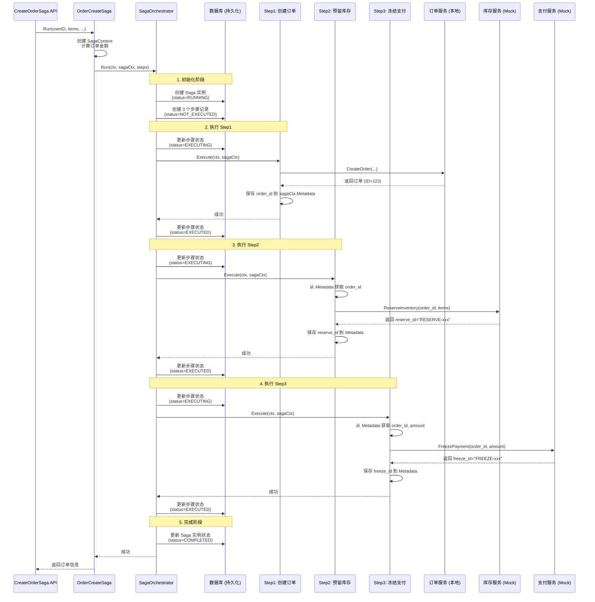
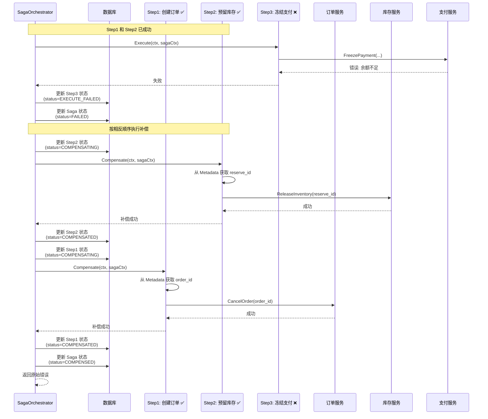
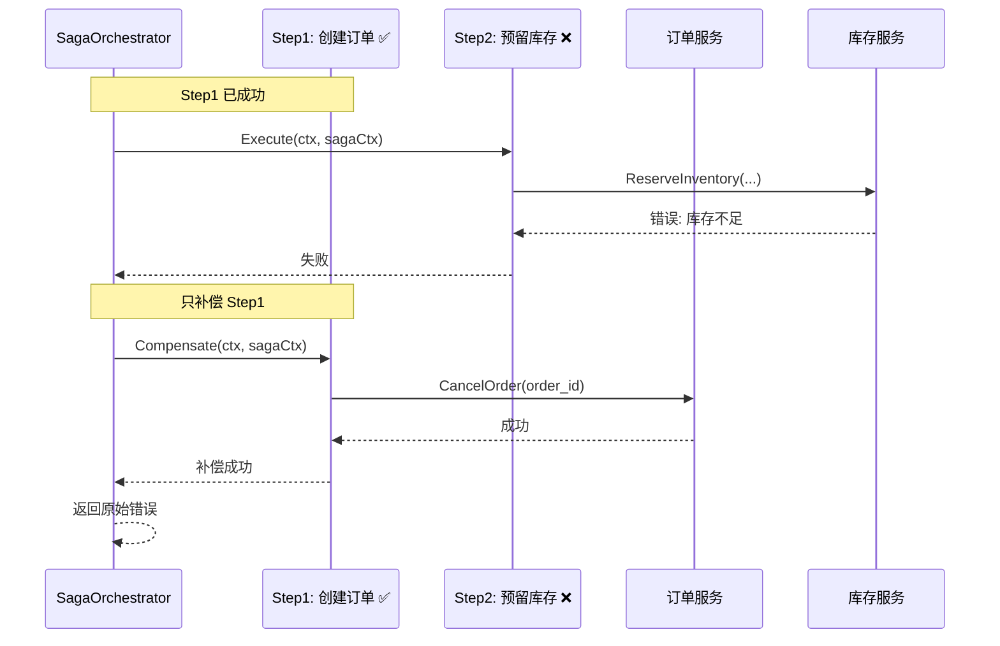
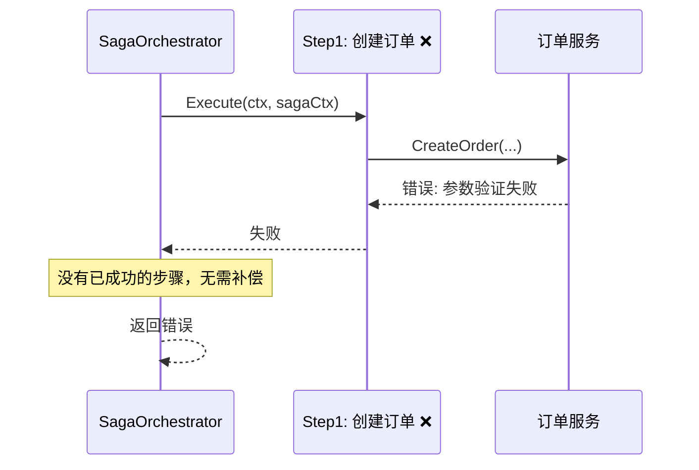
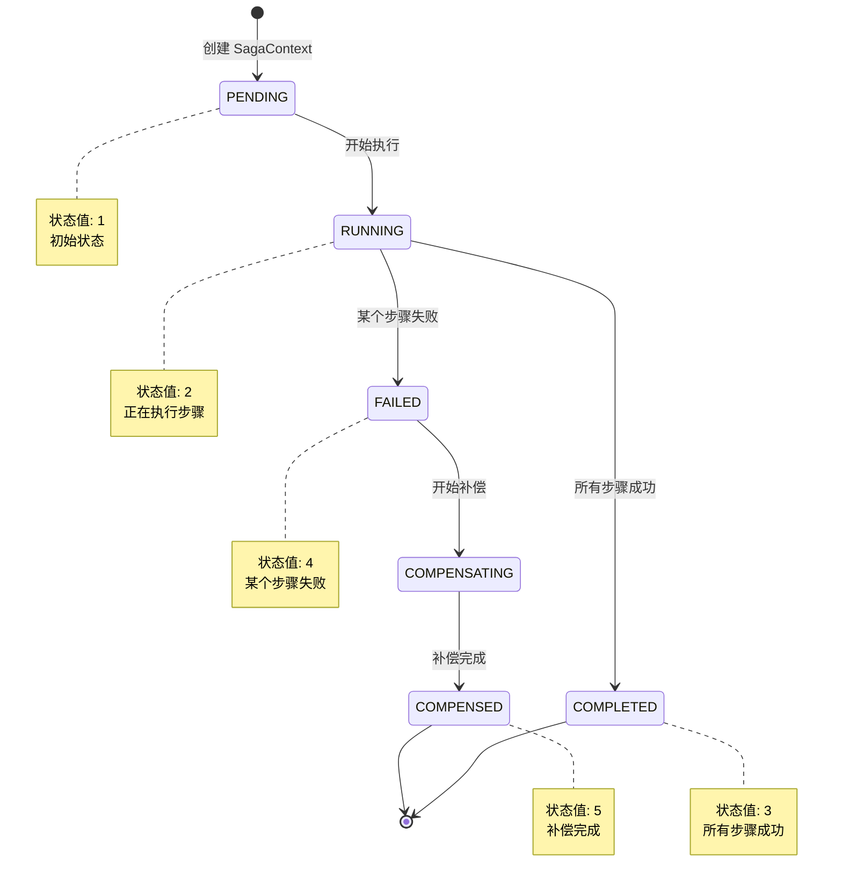
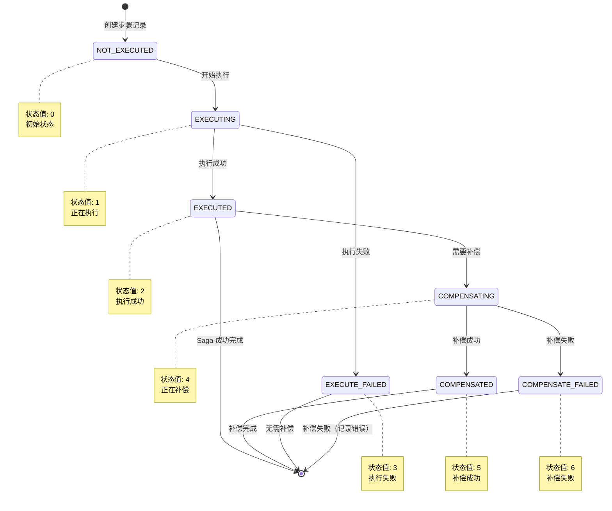

# Saga 订单创建流程详解

本文档详细说明基于 Saga 模式的订单创建流程，包括成功流程、失败补偿流程、状态转换和数据流转。

## 目录

- [整体架构](#整体架构)
- [成功流程](#成功流程)
- [失败补偿流程](#失败补偿流程)
- [状态转换图](#状态转换图)
- [数据流转](#数据流转)
- [步骤详解](#步骤详解)
- [持久化机制](#持久化机制)

---

## 整体架构

```
┌─────────────────────────────────────────────────────────────────┐
│                        API 层 (Service)                          │
│  CreateOrderSaga API (HTTP/gRPC)                                 │
└────────────────────────────┬────────────────────────────────────┘
                              │
                              ▼
┌─────────────────────────────────────────────────────────────────┐
│                    业务层 (Biz - OrderCreateSaga)                 │
│  - 创建 SagaContext                                             │
│  - 定义 3 个步骤                                                │
│  - 调用 SagaOrchestrator.Run()                                  │
└────────────────────────────┬────────────────────────────────────┘
                              │
                              ▼
┌─────────────────────────────────────────────────────────────────┐
│                 编排层 (Biz - SagaOrchestrator)                   │
│  - 持久化 Saga 实例和步骤状态                                    │
│  - 按顺序执行步骤                                                │
│  - 失败时按相反顺序执行补偿                                      │
└────────────────────────────┬────────────────────────────────────┘
                              │
        ┌─────────────────────┼─────────────────────┐
        │                     │                     │
        ▼                     ▼                     ▼
┌──────────────┐    ┌──────────────┐    ┌──────────────┐
│  Step 1      │    │  Step 2      │    │  Step 3      │
│  创建订单     │    │  预留库存     │    │  冻结支付     │
│  (本地服务)   │    │  (库存服务)   │    │  (支付服务)   │
└──────────────┘    └──────────────┘    └──────────────┘
```

---

## 成功流程

### 流程图



### 步骤说明

#### 阶段 1: 初始化
1. **创建 SagaContext**
   - `SagaID`: `SAGA-{timestamp}-{userID}`
   - `Type`: `"order.create"`
   - `Metadata`: `{"user_id": "1"}`

2. **持久化 Saga 实例**
   - 插入 `saga_instances` 表
   - `status = RUNNING (2)`

3. **创建步骤记录**
   - 插入 3 条 `saga_steps` 记录
   - `step_order`: 0, 1, 2
   - `status = NOT_EXECUTED (0)`

#### 阶段 2: 执行 Step1 - 创建订单
1. **更新步骤状态**: `EXECUTING (1)`
2. **调用订单服务**: `OrderUsecase.CreateOrder()`
3. **保存订单信息到 Metadata**:
   ```json
   {
     "order_id": "123",
     "order_no": "SAGA-1234567890-1"
   }
   ```
4. **更新步骤状态**: `EXECUTED (2)`

#### 阶段 3: 执行 Step2 - 预留库存
1. **更新步骤状态**: `EXECUTING (1)`
2. **从 Metadata 获取**: `order_id`, `order_no`
3. **调用库存服务**: `inventoryClient.ReserveInventory()`
4. **保存预留ID到 Metadata**:
   ```json
   {
     "inventory_reserve_id": "RESERVE-1234567890-123"
   }
   ```
5. **更新步骤状态**: `EXECUTED (2)`

#### 阶段 4: 执行 Step3 - 冻结支付
1. **更新步骤状态**: `EXECUTING (1)`
2. **从 Metadata 获取**: `order_id`, `order_no`, `amount`
3. **调用支付服务**: `paymentClient.FreezePayment()`
4. **保存冻结ID到 Metadata**:
   ```json
   {
     "payment_freeze_id": "FREEZE-1234567890-123"
   }
   ```
5. **更新步骤状态**: `EXECUTED (2)`

#### 阶段 5: 完成
1. **更新 Saga 实例状态**: `COMPLETED (3)`
2. **设置完成时间**: `completed_at = now()`
3. **返回订单信息**

---

## 失败补偿流程

### 场景 1: Step3 失败（冻结支付失败）



### 场景 2: Step2 失败（预留库存失败）



### 场景 3: Step1 失败（创建订单失败）



### 补偿执行顺序

**重要原则**: 按**相反顺序**补偿已成功的步骤

| 失败步骤 | 已成功步骤 | 补偿顺序 |
|---------|-----------|---------|
| Step1   | 无        | 无需补偿 |
| Step2   | Step1     | Step1   |
| Step3   | Step1, Step2 | Step2 → Step1 |

---

## 状态转换图

### Saga 实例状态转换



### 步骤状态转换



---

## 数据流转

### SagaContext 元数据演变

#### 初始状态
```json
{
  "user_id": "1"
}
```

#### Step1 执行后
```json
{
  "user_id": "1",
  "order_id": "123",
  "order_no": "SAGA-1234567890-1"
}
```

#### Step2 执行后
```json
{
  "user_id": "1",
  "order_id": "123",
  "order_no": "SAGA-1234567890-1",
  "inventory_reserve_id": "RESERVE-1234567890-123"
}
```

#### Step3 执行后
```json
{
  "user_id": "1",
  "order_id": "123",
  "order_no": "SAGA-1234567890-1",
  "inventory_reserve_id": "RESERVE-1234567890-123",
  "payment_freeze_id": "FREEZE-1234567890-123"
}
```

### 数据库记录示例

#### saga_instances 表
```sql
id | saga_id              | saga_type    | status | metadata                    | started_at          | completed_at
---|----------------------|--------------|--------|-----------------------------|---------------------|-------------------
1  | SAGA-1234567890-1   | order.create | 3      | {"order_id":"123",...}      | 2024-01-01 10:00:00 | 2024-01-01 10:00:05
```

#### saga_steps 表
```sql
id | saga_id              | step_name         | step_order | status | executed_at          | compensated_at
---|----------------------|-------------------|------------|--------|----------------------|-------------------
1  | SAGA-1234567890-1   | create-order      | 0          | 2      | 2024-01-01 10:00:01 | NULL
2  | SAGA-1234567890-1   | reserve-inventory | 1          | 2      | 2024-01-01 10:00:03 | NULL
3  | SAGA-1234567890-1   | freeze-payment    | 2          | 2      | 2024-01-01 10:00:05 | NULL
```

---

## 步骤详解

### Step1: 创建订单 (create-order)

**执行逻辑**:
```go
1. 调用 OrderUsecase.CreateOrder()
   - 创建订单记录
   - 创建订单项记录
   - 写入 Outbox 事件（OrderCreatedEvent）
   
2. 保存订单信息到 SagaContext.Metadata
   - order_id: 订单ID
   - order_no: 订单号
```

**补偿逻辑**:
```go
1. 从 Metadata 获取 order_id
2. 调用 OrderUsecase.CancelOrder(order_id)
   - 更新订单状态为已取消
   - 记录取消原因
```

**依赖关系**:
- ✅ 无前置依赖
- ✅ 为 Step2 和 Step3 提供 `order_id` 和 `order_no`

---

### Step2: 预留库存 (reserve-inventory)

**执行逻辑**:
```go
1. 从 SagaContext.Metadata 获取:
   - order_id
   - order_no
   
2. 转换订单项为库存项
   - ProductID, Quantity
   
3. 调用 inventoryClient.ReserveInventory()
   - 请求: {OrderID, OrderNo, Items}
   - 响应: {Success, ReserveID}
   
4. 保存 reserve_id 到 Metadata
```

**补偿逻辑**:
```go
1. 从 Metadata 获取:
   - inventory_reserve_id
   - order_id
   
2. 调用 inventoryClient.ReleaseInventory()
   - 请求: {ReserveID, OrderID}
   - 响应: {Success}
```

**依赖关系**:
- ⚠️ 依赖 Step1 提供的 `order_id` 和 `order_no`
- ✅ 为 Step3 提供 `inventory_reserve_id`（可选，用于日志追踪）

---

### Step3: 冻结支付 (freeze-payment)

**执行逻辑**:
```go
1. 从 SagaContext.Metadata 获取:
   - order_id
   - order_no
   
2. 从步骤参数获取:
   - user_id
   - amount
   - currency
   
3. 调用 paymentClient.FreezePayment()
   - 请求: {OrderID, OrderNo, UserID, Amount, Currency}
   - 响应: {Success, FreezeID}
   
4. 保存 freeze_id 到 Metadata
```

**补偿逻辑**:
```go
1. 从 Metadata 获取:
   - payment_freeze_id
   - order_id
   
2. 调用 paymentClient.UnfreezePayment()
   - 请求: {FreezeID, OrderID}
   - 响应: {Success}
```

**依赖关系**:
- ⚠️ 依赖 Step1 提供的 `order_id` 和 `order_no`
- ✅ 无后续依赖（最后一个步骤）

---

## 持久化机制

### 持久化时机

1. **Saga 启动时**
   - 创建 `saga_instances` 记录
   - 创建所有 `saga_steps` 记录

2. **每个步骤执行前**
   - 更新步骤状态为 `EXECUTING`

3. **每个步骤执行后**
   - 成功: 更新状态为 `EXECUTED`，记录 `executed_at`
   - 失败: 更新状态为 `EXECUTE_FAILED`，记录 `error_message`

4. **补偿执行时**
   - 更新步骤状态为 `COMPENSATING`
   - 成功: 更新状态为 `COMPENSATED`，记录 `compensated_at`
   - 失败: 更新状态为 `COMPENSATE_FAILED`，记录 `error_message`

5. **Saga 完成时**
   - 更新 `saga_instances` 状态
   - 记录 `completed_at`

### 持久化的好处

1. **可追溯性**: 可以查询任何 Saga 实例的完整执行历史
2. **可恢复性**: 如果服务崩溃，可以根据持久化状态恢复 Saga
3. **可监控性**: 可以监控 Saga 的成功率、失败率、补偿率
4. **可调试性**: 可以查看每个步骤的详细执行时间和错误信息

---

## 关键设计点

### 1. 补偿顺序

**原则**: 按相反顺序补偿已成功的步骤

**原因**: 
- 后执行的步骤可能依赖先执行的步骤
- 先补偿后执行的步骤，再补偿先执行的步骤，可以避免依赖问题

**示例**:
- Step1 → Step2 → Step3
- 如果 Step3 失败，补偿顺序: Step2 → Step1

### 2. 元数据传递

**方式**: 通过 `SagaContext.Metadata` 传递步骤间的数据

**优点**:
- 步骤之间解耦
- 不需要修改步骤接口
- 数据持久化到数据库

**缺点**:
- 需要手动管理 key
- 类型不安全（都是 string）

### 3. 错误处理

**策略**:
- 步骤执行失败: 立即停止，开始补偿
- 补偿失败: 记录错误，继续尝试其他步骤的补偿
- 最终返回: 返回原始执行失败的错误

**原因**:
- 补偿失败不应该阻止其他步骤的补偿
- 但整体 Saga 仍然标记为失败

### 4. 幂等性

**当前实现**: 未完全实现幂等性

**建议**:
- 每个步骤的 Execute 和 Compensate 应该是幂等的
- 可以通过检查步骤状态来避免重复执行

---

## 总结

Saga 模式通过以下机制保证分布式事务的一致性：

1. **分阶段提交**: 将大事务拆分为多个小事务
2. **补偿机制**: 失败时自动回滚已成功的操作
3. **状态持久化**: 记录每个步骤的执行状态，支持恢复和监控
4. **编排器**: 统一管理步骤的执行顺序和补偿逻辑

这种模式特别适合：
- 跨多个服务的长时间运行的事务
- 需要灵活补偿逻辑的场景
- 对最终一致性要求较高的场景

