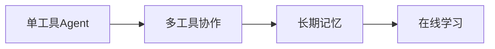

### 一、AI大模型是什么？
1. 本质：一个通过「阅读」互联网上万亿文字资料训练出的数字大脑

    - 相当于把整个图书馆的书喂给电脑学习

    - 例子：ChatGPT的训练数据≈3000亿个单词（是整个维基百科的1000倍）

2. 核心特点：

    - ✅ 大：参数量超过人脑神经元数量（GPT-3有1750亿参数，人脑约860亿神经元）

    - ✅ 通用：像瑞士军刀一样能处理多种任务

    - ✅ 会学习：通过对话不断优化回答（类似人类「吃一堑长一智」）

### 二、它到底能做什么？    
1. 实用功能（像你的智能助理）

| 场景 | 具体能力 | 现实例子 |
| --- | --- | --- |
| 学习工作 | 写报告/做PPT/翻译/写代码 | 1小时写完毕业论文提纲 |
| 生活娱乐 | 推荐菜谱/写朋友圈文案/讲故事 | 生成「朋友圈晒猫文学」 |
| 专业领域 | 法律咨询/医疗建议/金融分析 | 解读体检报告专业术语 |
2. 🎨 创造能力（像艺术家+科学家）
- 文字创作：写小说/诗歌/广告文案（已有人用AI写书出版）

- 图像生成：根据描述画图（如Midjourney生成动漫头像）

- 音乐制作：自动谱曲（Google的MusicLM可生成3分钟完整乐曲）

3. 💡 特殊技能
- 考试能手：通过美国医师执照考试（GPT-4得分前10%）

- 编程大神：能解决LeetCode中等难度算法题（相当于2年经验程序员）

- 语言天才：支持100+种语言互译（比多数人类翻译更快）


### 三、基础层（像学做菜要先认识食材）
1. 核心架构（模型的"大脑结构"）
    - Transformer：模型的"大脑结构"（类似人脑神经元网络）

    - 注意力机制：让AI学会"抓重点"（像读书时划重点）
    - 推荐资源：《Attention Is All You Need》论文图解

2. 硬件基础
    - GPU/TPU：模型的"厨房灶台"（算力越强训练越快）
    - 分布式训练：多人协作炒菜（数据/模型/流水线并行）
    - 工具：NVIDIA CUDA文档


### 四、训练层（像培养一个天才儿童）
1. 预训练（像给孩子教育一样）
    - 数据清洗：准备营养均衡的"精神食粮"（过滤低质内容）
    - 训练目标：
        - 自回归：预测下一个词（像接龙游戏）
        - 自编码：完形填空（BERT式训练）
        - *案例：GPT-3用了45TB文本数据*

2. 微调技术（像给孩子额外教育一样）
    - 微调目标：
        - 指令微调：根据指令调整模型行为（像"写作文"、"翻译"）
        - 奖励模型：奖励模型根据奖励调整模型行为（RLHF）
    - 工具：HuggingFace Transformers库

### 五、应用层（像给超脑安装技能包）
| 技术 | 作用 | 典型应用 |
| --- | --- | --- |
| Prompt工程 | 用"魔法咒语"激活能力 | 让AI写七言藏头诗 |
| RAG | 给AI插上"外部记忆U盘" | 结合最新资料回答问题 |
| Agent | 让AI自主完成任务链 | 自动订机票+写旅行攻略 |

### 六、前沿方向（AI科研热点）
1. MoE架构：
    - 让模型变成"专家委员会"（不同问题激活不同子网络）
    - 案例：Google的Switch Transformer

2. 多模态学习：
    - 给AI装上"眼睛和耳朵"（同时处理文本/图像/音频）
    - 工具：OpenAI CLIP

3. 推理优化：
    - 思维链(CoT)：让AI"写出解题步骤"
    - 自洽性校验：多个答案投票选最优

### 学习路径
1. 理论进阶
    ```mermaid
    graph LR
    A[Python基础] --> B[PyTorch框架]
    B --> C[Transformer实现]
    C --> D[分布式训练]
    ```
2. 实践入门
    - 玩转ChatGPT提示词（推荐《Prompt Engineering指南》）
    - 用AutoTrain微调小模型（无需编程）

### 应用层开发
#### 一、基础技术栈
| 技术领域 | 关键技能 | 工具/框架示例 | 学习重点 |
| --- | --- | --- | --- |
| 编程语言 | Python(必学)、JavaScript | Jupyter Notebook, Node.js | Python异步编程、装饰器语法 |
| API开发 | RESTful/gRPC接口开发 | FastAPI, Flask, Express | 鉴权设计(JWT/OAuth2) |
| 数据处理 | 数据清洗/向量化 | Pandas, NumPy, SpaCy | 文本分块(Text Chunking) |
| 数据库 | SQL, NoSQL | MongoDB, PostgreSQL | 索引优化、事务处理 |
| 前端开发 | HTML/CSS/JS | React, Vue.js, Angular | 响应式设计、组件化开发 |
| 后端开发 | Python框架 | Django, Flask | 路由设计、数据库集成 |

#### 二、大模型核心技术
##### 1. 模型接入
- 模型API：提供大模型的推理服务（如OpenAI的API）
- 模型SDK：封装模型API调用，提供更高级的功能（如LangChain）
##### 2. 数据处理
- 数据清洗：确保数据质量（如缺失值处理、异常值处理）
- 向量化：将文本转换为数值向量（如BERT、GPT-3的嵌入向量）
##### 3. 应用开发
- 任务链设计：组织模型调用流程（如LangChain的PromptTemplate）
- 动态参数配置：根据用户输入调整模型行为（如LangChain的DynamicPrompt）
##### 4. 提示工程
- 高级技巧：
    - 思维链(CoT)："请逐步思考..."
    - 模板引擎：Jinja2动态生成prompt
    - 少样本学习：在prompt中嵌入示例
    - 推荐工具：LangChain PromptHub
##### 5. 检索增强(RAG)
- 原理：结合外部知识（如文档、数据库）增强模型回答
- 实现：
    - 向量化索引：将文档/数据库内容向量化
    - 语义搜索：根据问题找相关文档
    - 文档合并：将相关文档内容传入模型
- 核心组件：
    - 向量数据库：Pinecone, Milvus
    - 嵌入模型：text-embedding-3-small    
##### 6. 模型部署
- 容器化：将模型和应用打包成Docker镜像
- 云服务：在K8s上部署模型服务（如OpenAI的API）

#### 三、工程化开发
1. 性能优化

| 技术手段 | 效果提升 | 实现方式 |
| --- | --- | --- |
|缓存|	减少30%+ API调用|	Redis缓存相似问题回答|
|批处理|	吞吐量提升5-10x	|合并多个用户请求|
|模型量化|	推理速度提升2-3倍|	GGML格式+Llama.cpp|

2. 监控运维
- 关键指标：
    - 令牌消耗统计
    - 响应延迟百分位(P99)
    - 错误类型分类
- 工具链：Prometheus+Grafana+ELK

3. 安全防护
- 必须实现的措施：
    - 输入过滤（防Prompt注入）
    - 输出审核（敏感词过滤）
    - 速率限制（防API滥用）
- 可选措施：
    - 访问控制（IP白名单）
    - 数据加密（HTTPS）
    - 异常检测（模型异常检测）
    - 模型监控（模型异常检测）
#### 四、进阶架构

1. Agent系统开发
- 核心组件：
    - 工具注册机制：定义和注册模型可以使用的工具
    - 路由决策模块：根据用户问题选择合适的工具
    - 记忆管理：存储和管理与用户交互相关的信息
- 实现方式：
    - 基于Python的Flask框架
    - 基于LangChain的Agent架构
    - 自定义工具集成
2. 多模态集成
- 典型工作流：
    - 用户上传图片
    - CLIP生成描述
    - 文本模型处理描述
    - 生成图文混合回答
- 框架：Transformers.js (浏览器端推理)

#### 五、学习路线建议
1. 新手阶段(1个月)：
    - 完成OpenAI官方Quickstart教程
    - 用Flask搭建简易聊天机器人
2. 中级阶段(3个月)：
    - 实现带RAG的问答系统
    - 掌握LangChain/AutoGPT框架
3. 高级阶段(6个月+)：
    - 开发自治Agent系统
    - 优化模型微调Pipeline
#### 六、避坑指南
1. 常见错误：

    - 未处理API限流（导致服务不可用）

    - 忽略token长度限制（截断重要信息）

    - 过度依赖单一模型提供商

2. 性能陷阱：

    - 同步阻塞调用（改用异步IO）

    - 频繁加载大模型（使用模型服务化）


 ###  Agent（智能体）
 >AI 领域的 Agent（智能体） 是一种能自主决策、执行复杂任务的智能系统，它比普通聊天/问答机器人更接近「数字员工」的概念。
 它可以根据环境变化（如新任务、新信息）自主调整策略，执行一系列动作（如搜索、思考、编写代码），并根据执行结果及时调整策略。
 这些动作通常需要与外部系统（如数据库、文件系统、API）交互，以获取信息或执行任务。
 一个Agent通常由以下几个部分组成：
 >- 策略（Policy）：定义了Agent如何根据环境变化作出决策。
 >- 模型（Model）：执行具体的动作（如搜索、思考、编写代码）。
 >- 记忆（Memory）：存储与任务相关的过去经验，用于调整策略。
 >- 工具（Tools）：与外部系统交互的接口，用于获取信息或执行任务。
 >- 环境感知模块（Environment Model）：模拟Agent与外部世界的交互，用于更新记忆。


#### 一、Agent vs 普通聊天机器人
| 维度 | 聊天/问答机器人 | Agent智能体 |
| --- | --- | --- |
| 任务范围 | 单轮简单问答 | 多步骤跨平台任务 |
| 决策方式 | 被动响应 | 主动规划+工具调用 |
| 记忆能力 | 短期对话记忆 | 长期经验积累 |
| 错误处理 | 直接报错 | 自动重试/替代方案 |
| 交互模式 | 用户全程指导 | 用户只需给目标 |
| 生活化比喻 | 聊天机器人像「自动应答机」：你问它答 | Agent 像「私人助理」：你说"安排出差"，它会自动订机票、选酒店、写行程 |

#### 二、Agent的核心能力（高阶之处）
    1. 自主规划能力
        - 原理：根据任务描述，自动生成执行计划（如搜索关键词、调用工具等）
        - 实现：
            - 基于自然语言理解（NLU）：理解用户指令
            - 基于规划器（Planner）：生成执行策略
            - 基于执行器（Executor）：执行策略
        - 关键组件：
            - 自然语言理解模型：如OpenAI的GPT-3
            - 规划器模型：如OpenAI的Function Calling
            - 执行器模型：自定义工具或API
    - 优势：
        - 无需硬编码任务逻辑：只需定义工具函数，Agent就能执行复杂任务
        - 动态调整策略：根据环境变化实时调整策略
        - 支持跨平台任务：只需描述任务目标，Agent就能在不同平台执行
    - 案例:
        - 自动订机票：用户描述"我要从北京到上海出差"，Agent自动规划搜索机票、酒店信息
        - 文档处理：用户描述"我要提取合同中的条款"，Agent自动规划调用文档处理工具
        - 用户说"帮我分析竞品" → Agent自动:
            1. 爬取竞品网站
            2. 提取关键数据
            3. 生成对比报告
    - ```mermaid
    graph TB
        A[用户目标] --> B(任务分解)
        B --> C{是否需要工具?}
        C -->|是| D[调用API/工具]
        C -->|否| E[直接回答]
        D --> F[结果验证]
        F --> G[组合输出]
    ```    

2. 工具使用能力
3. 记忆与学习
    - 短期记忆：当前会话上下文
    - 长期记忆：向量数据库存储历史经验
    - 动态调整策略：根据环境变化实时调整策略
    - 支持跨平台任务：只需描述任务目标，Agent就能在不同平台执行
    - 自我优化：从失败中学习策略（如API调用频率限制后自动调整）


#### 三、Agent需要的额外知识
1. 系统架构知识
    - 状态管理：跟踪任务执行进度
    - 容错设计：当某个工具失效时的备用方案
    - 安全沙箱：限制代码执行权限
2. 工具集成技术
    - 工具类型	实现方式	示例
    - Web操作	Playwright/Selenium	自动填写表单
    - API调用	OpenAPI规范	调用天气查询接口
    - 数据处理	Pandas/SQL集成	自动生成Excel报表
3. 决策算法
    - 强化学习：PPO算法优化长期收益
    - 规则引擎：IF-THEN规则处理边界情况
    - 成本控制：平衡API调用费用与效果

#### 四、典型Agent工作流
>以「安排团队聚餐」为例：

1. 理解用户意图：识别时间/人数/偏好等隐含需求
2. 规划执行策略：
    - 调用地图API找餐厅
    - 访问点评网站筛选评分
    - 读取成员日历查空闲时间
3. 冲突解决：
    - 发现时间冲突后，自动调整方案
    - 可能需要调用日历API调整他人日程
4. 执行确认：
    - 向所有成员发送确认邮件
    - 收集反馈（如是否需要调整时间/是否取消）
5. 监控反馈：
    - 及时调整策略（如调整时间/取消会议）
    - 评估执行效果（如成员参与度/满意度）
6. 工具调用：
    - 调用地图API找餐厅
    - 访问点评网站筛选评分
    - 读取成员日历查空闲时间
    - 发送邮件确认/调整会议时间
7. 错误处理：
    - 处理API限流问题
    - 监控工具失效情况

#### 五、为什么属于高阶开发？
1. 复杂度指数上升：
    - 普通问答：处理1个问题 → 1个回答
    - Agent系统：1个目标 → N个动作 × M个备选方案

2. 新问题涌现：
    - 如何防止无限循环？
    - 工具调用失败如何回滚？
    - 怎样评估任务完成质量？

3. 调试难度大：
    - 需监控整个决策链
    - 可能出现"蝴蝶效应"（小错误导致连锁问题）

#### 六、学习路径建议
1. 先掌握基础：
    - 熟练使用LangChain等框架
    - 理解RAG技术原理
2. 小实验开始：
    ```python
    from langchain.agents import initialize_agent
    agent = initialize_agent(tools, llm, agent="zero-shot-react-description")
    agent.run("用Python计算3的阶乘，然后翻译成法语") 
    ```
3. 渐进式复杂化：
    - 单工具Agent：无需记忆，效率高
    - 多工具协作：可处理复杂任务，如跨平台整合
    - 长期记忆：有能力处理跨会话信息
    - 在线学习：能根据环境变化实时调整策略
    
4. 关键认知：Agent开发是系统工程，需要平衡：
    - 自主性 vs 可控性
    - 效率 vs 成本
    - 通用性 vs 专业性
5. 理论进阶


6. 实践入门
    - 玩转ChatGPT提示词（推荐《Prompt Engineering指南》）
    - 用AutoTrain微调小模型（无需编程）


    