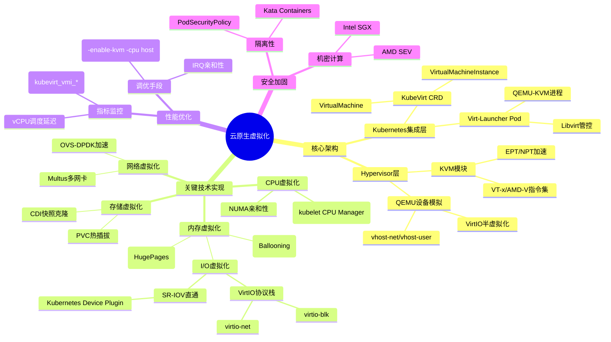

## 云原生虚拟化（Cloud-Native Virtualization）核心知识体系
1. 原生虚拟化是通过扩展Kubernetes API（如KubeVirt）在容器平台上运行传统虚拟机（VM）的技术，核心价值是统一管理容器和VM，兼顾隔离性（VM）与敏捷性（容器）
- 遗留应用现代化（如迁移Windows服务上云）
- 高性能计算（GPU/FPGA直通）
- 安全敏感负载（SEV加密内存）
2. 与传统虚拟化的区别
维度	传统虚拟化（VMware）	云原生虚拟化（KubeVirt）
管理平面	vCenter	kubectl/K8s API
资源调度	静态分配	动态调度（与容器混合部署）
启动速度	分钟级	秒级（Firecracker <1s）
网络/存储	专用SDN/存储	复用CNI/CSI生态

### 核心技术深度解析
1. CPU虚拟化（KVM）,KVM如何实现高性能CPU虚拟化？
- 硬件辅助：依赖Intel VT-x/AMD-V指令集，通过VMXON进入非根模式，客户机指令直接运行在物理CPU。
- 调度优化：vCPU绑定物理核（cpuManagerPolicy: static），减少上下文切换。
2. 内存虚拟化（EPT）EPT如何解决内存虚拟化性能问题？
- 问题：早期影子页表需Hypervisor维护GVA→HPA映射，开销大。
- EPT方案：CPU硬件支持两级转换（GVA→GPA→HPA），客户机页表更新无需陷入Hypervisor。
- 效果：TLB命中率提升，SPECvirt测试中性能损失<5%。
3. I/O虚拟化（VirtIO）VirtIO相比模拟设备有哪些优化？
- 前端驱动：客户机内核内置virtio-blk/virtio-net，避免二进制翻译
- 后端加速: vhost-net：将数据面卸载到内核线程。vhost-user：用户态DPDK加速，延迟降低10倍
- 配置示例：KubeVirt中指定bus: virtio，virtio-blk指定scsi控制器。
### 云原生集成与实战
1. KubeVirt架构 描述KubeVirt如何与Kubernetes集成？
- CRD扩展：定义VirtualMachine、VirtualMachineInstance等资源
- 工作原理：
  - virt-controller监听VM创建/删除事件，触发virt-handler处理。
  - virt-handler通过libvirt管理VM生命周期。
- 资源管理：通过K8s的ResourceQuota限制vCPU/内存/磁盘资源，每个VM有独立资源配额。
2. 数据面网络配置 如何在KubeVirt中配置VM网络？
 - 网络模型：KubeVirt支持OVN/Kuryr/VLAN等网络插件，默认VLAN。
 - 网络配置：在VirtualMachine定义中指定network:
3. 安全加固 如何保障云原生虚拟化的安全性？
- 隔离性：PodSecurityPolicy限制VM容器的权限。
- 机密计算：AMD SEV加密VM内存，防止宿主机窃取。
- 镜像安全：通过OPA/Gatekeeper校验VM镜像签名

#### 脑图面试场景应用指南
1. 请描述KubeVirt如何将虚拟机融入K8s体系？
- Kubernetes集成层 → KubeVirt CRD
  1. VirtualMachine定义VM规格（类比Deployment）
  2. VirtualMachineInstance对应运行实例（类比Pod）

- Hypervisor层 → Virt-Launcher Pod
  1. 每个VM由Pod托管，内部跑QEMU-KVM进程
  2. 复用K8s调度/网络/存储能力

2. 如何优化云原生虚拟机的I/O性能？
- 关键技术实现 → I/O虚拟化
  1. 首选VirtIO（virtio-blk比IDE模拟性能高3倍）
  2. 极端场景用SR-IOV直通（需Device Plugin注册VF）

- 性能优化 → 调优手段
  1. vhost-net将网络数据面卸载到内核
  2. DPDK加速场景换vhost-user
3. EPT在内存虚拟化中如何工作？
- Hypervisor层 → KVM模块 → EPT/NPT加速
  1. EPT：客户机页表GVA→GPA转换，GPA查HPA。
  2. NPT：仅Hypervisor维护GVA→HPA映射。
