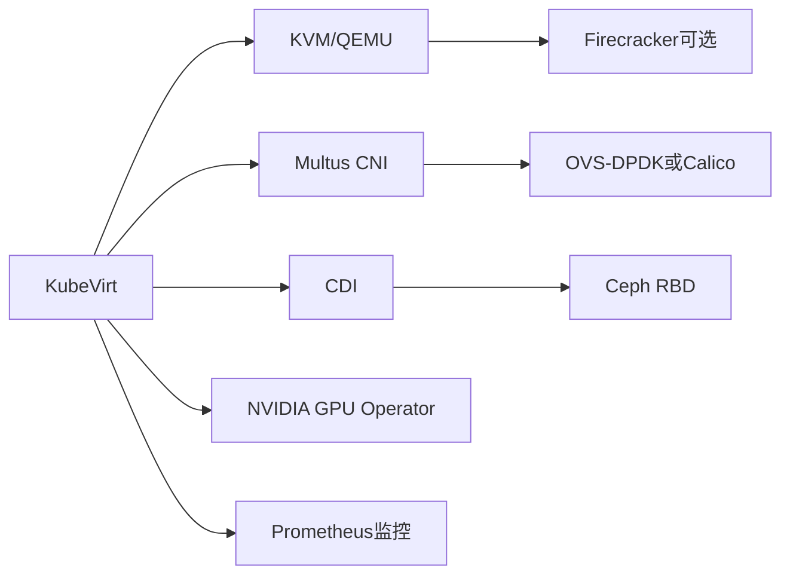

## 云原生虚拟化技术栈（如KubeVirt）的开源实现

### 一、核心虚拟化技术开源实现
1. 虚拟化引擎

| 项目       | 作用                                  | 云原生集成               | 关键特性                              |
|:-----------|:-------------------------------------|:-----------------------:|:------------------------------------:|
| KVM        | Linux内核模块，提供CPU/内存虚拟化     | KubeVirt默认Hypervisor   | 硬件加速（VT-x/AMD-V），EPT内存优化   |
| QEMU       | 设备模拟与跨平台支持                  | KubeVirt中运行VM        | 支持VirtIO半虚拟化、快照、动态迁移    |
| Firecracker| 轻量MicroVM引擎                       | AWS Lambda、KubeVirt可选后端 | 极速启动（<125ms），内存开销<5MB  |
| Libvirt    | 虚拟化API与管理工具                   | 其他虚拟化工具集成       | 支持QEMU/KVM、VMware等生命周期管理    |
| virtctl    | 命令行工具，管理Libvirt虚拟机         | 与KubeVirt集成           | 支持创建、启动、停止、迁移等操作      |

2. 容器化虚拟化管理

|项目|作用|关键特性|
|--|--|--|
|KubeVirt|Kubernetes原生虚拟机管理框架|通过CRD管理VM，复用K8s网络/存储|
|Virtlet|直接通过CRI运行VM|兼容Kubernetes Pod模型，无需额外组件|

### 二、网络虚拟化开源方案

1. 多网络与高性能方案

|项目|作用|集成KubeVirt|
|--|--|--|
|Multus CNI|为Pod/VM提供多网卡支持|支持VM多网络接口（管理网+业务网）|
|OVS-DPDK|用户态网络加速|提升VM网络吞吐（>25Gbps）|
|Calico|容器网络插件|为VM提供K8s原生网络策略|
2. 设备直通

|项目|作用|示例场景|
|--|--|--|
|SR-IOV Device Plugin|SR-IOV网卡资源管理|低延迟VM网络（金融交易场景）|
|VFIO|设备直通技术|高性能计算场景（AI/大数据）|
|DPDK|用户态数据包处理框架|高性能网络应用（如Firecracker）|
|SR-IOV VF IOCTL|用户态管理VFIO设备|VM中配置SR-IOV网卡|
|VFIO-PASSTHROUGH|VFIO直通技术|高性能存储场景（数据库、对象存储）|

### 三、存储虚拟化开源方案

|项目|作用|关键特性|
|--|--|--|
|Containerized Data Importer (CDI)	|虚拟机磁盘管理	|支持PVC动态供给、快照、克隆|
|Ceph RBD	|分布式块存储	|KubeVirt默认存储后端，支持快照和扩容|
|Longhorn	|轻量分布式块存储	|易于部署，适合边缘场景|

#### 本地存储开源方案

|项目|特点|适用场景|云原生集成|
|--|--|--|--|
|HwameiStor	|由灵雀云开发，将本地磁盘聚合为分布式存储，支持动态卷分配和快照	|Kubernetes 本地存储自动化管理	|原生支持 K8s（通过 CSI 驱动）|
|OpenEBS	|容器原生存储，支持多种引擎（LocalPV、cStor、Jiva）	|K8s 有状态应用（如数据库、消息队列）	|深度集成 K8s（CSI 驱动）|
|Rook (Ceph)	|通过 Ceph 将本地磁盘转为分布式存储，支持块/文件/对象存储	|需要高可用和扩展性的场景	|通过 Operator 部署|
|LVM LocalPV	|使用 LVM 管理本地磁盘，提供动态卷分配	|单节点高性能存储（如 AI 训练）	|需手动配置或结合 K8s CSI|
|TopoLVM	|基于 LVM 的 Kubernetes 本地存储方案，支持动态扩容和卷管理	|K8s 环境下的本地磁盘自动化	|原生 CSI 驱动|

功能对比
|功能|HwameiStor|Ceph (Rook)|TopoLVM|
|--|--|--|--|
|动态卷分配	|✅ 支持	|✅ 支持	|✅ 支持|
|快照/克隆	|✅ 支持	|✅ 支持	|❌ 不支持|
|多节点数据共享	|✅（通过副本同步）	|✅（核心功能）	|❌（仅单节点）|
|数据迁移	|✅（节点间迁移）	|✅（自动再平衡）	|❌（需手动迁移）|
|加密/压缩	|❌ 不支持	|✅ 支持	|❌ 不支持|

核心定位与架构
|特性|HwameiStor|Ceph (Rook)|TopoLVM|
|--|--|--|--|
|设计目标	|Kubernetes 本地磁盘自动化管理	|分布式统一存储（块/文件/对象）	|Kubernetes 本地磁盘动态分配|
|存储类型	|本地磁盘聚合为分布式存储	|分布式存储（多节点共享）	|单节点本地磁盘管理（基于 LVM）|
|数据冗余	|支持副本（多节点数据冗余）	|支持副本/纠删码（跨节点冗余）	|无冗余（依赖节点本地可靠性）|
|架构复杂度	|中等（需部署 Operator）	|高（需部署 Ceph 集群）	|低（轻量级 CSI 驱动）|

### 四、GPU虚拟化开源方案
|项目|作用|关键特性|
|--|--|--|
|NVIDIA GPU Operator	|自动化管理GPU资源	|为VM提供vGPU或直通GPU|
|Kata Containers	|轻量虚拟机运行时	|兼容K8s CRI，强隔离（可嵌套运行KubeVirt）|

### 五、监控与安全工具
|项目|作用|关键特性|
|--|--|--|
|kubevirt-metrics	|KubeVirt监控指标导出	|集成Prometheus，提供vCPU/内存/磁盘指标|
|Gatekeeper	|VM安全策略管理	|通过OPA限制VM镜像来源、资源配额|
|Kyverno	|K8s策略管理	|定义和应用K8s资源规则（如标签/注解/资源配额）|
|Kyverno Policy Controller	|OPA插件，管理Kyverno策略	|实时验证和应用K8s资源变更|
|Kyverno Policy Report	|策略报告UI	|可视化展示Kyverno策略执行结果|

### 六、开发与调试工具
|项目|作用|关键特性|
|--|--|--|
|virtctl	|KubeVirt命令行工具	|管理VM（启动/停止/控制台访问）|
|Kubebuilder	|开发KubeVirt扩展	|快速构建CRD和Operator|
|KubeVirt CI	|KubeVirt持续集成框架	|集成测试和构建KubeVirt镜像|

七、完整开源架构示例

### 八、应用场景与选型建议
- 通用云平台： KubeVirt + KVM + Ceph RBD + Multus
- 边缘计算： Firecracker + Longhorn（低资源占用）\
- AI/GPU负载：KubeVirt + NVIDIA GPU Operator + SR-IOV