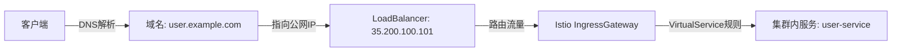
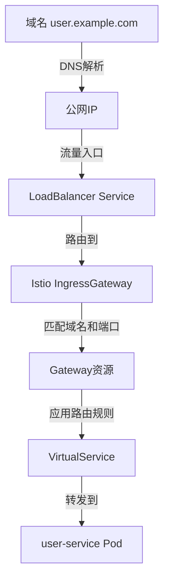
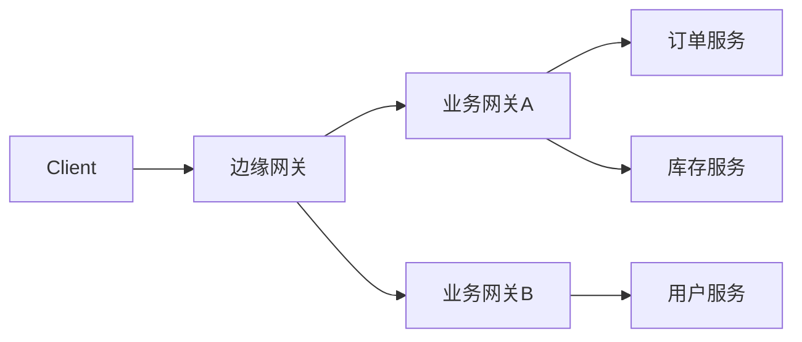
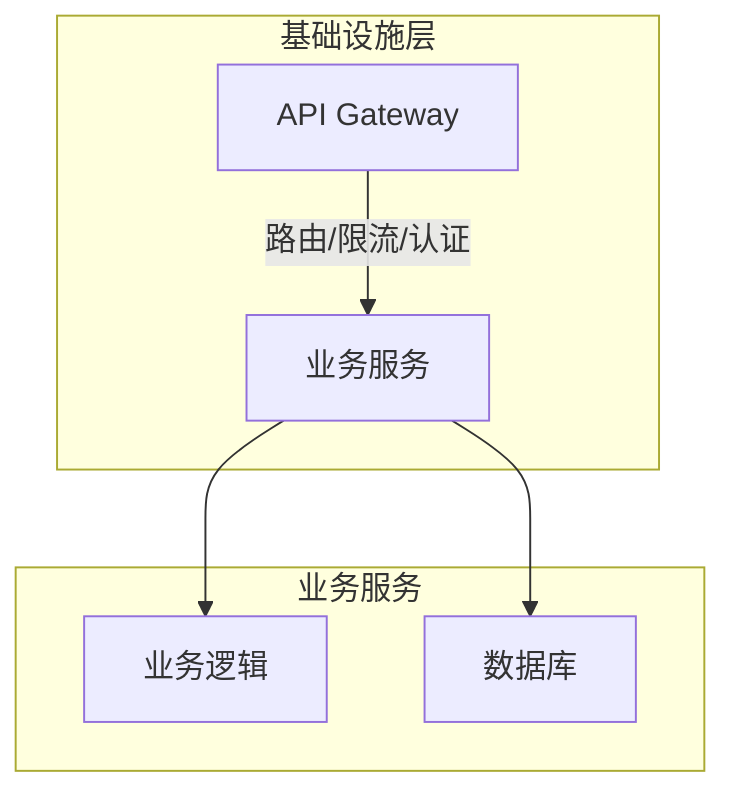
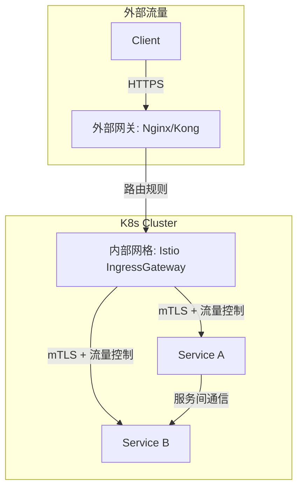

### 网关
#### 核心原则（职出边界）
- 对外统一入口：路由、认证、限流、监控等。
- 南北流量（North-South Traffic）：处理客户端（外部请求）到服务的流量。
- 东西流量（East-West Traffic）：通常指服务间的内部通信（是否经网关需权衡）。

##### 不经过网关（推荐多数场景）
- 适用场景：
  - 内部服务间通信频繁，要求低延迟、高吞吐。
  - 服务间已具备服务发现（如Consul、Nacos）和负载均衡（如Ribbon）。
  - 内部调用无需网关级别的策略（如外部认证、全局限流）
- 优势
  - 性能更高：减少网关跳转的延迟和单点压力
  - 简化架构：内部直接通过服务名（如K8s Service、Dubbo接口）调用
##### 经过网关（特定需求）
  - 适用场景：
    - 需要统一管控所有流量（如全链路审计、日志集中收集）。
    - 内部调用需复用网关的认证/鉴权逻辑（如JWT校验）。
    - 跨网络分区通信（如不同VPC的服务需通过网关暴露）。
  - 劣势
    - 性能损耗：多一跳网络延迟，网关可能成为瓶颈。
    - 复杂性：需维护网关路由规则和内部服务暴露策略

1. 定义 Proto 文件
2. 生成 Golang gRPC 代码 protoc 
3. protoc --grpc-gateway_out=. service.proto
4. 同时 监听gRPC 和 HTTP 请求
4. 集成到K8s流量
  - 外部流量：
    - 直接暴露 HTTP 端口，通过 Nginx 等反向代理处理。
    - gRPC 接口暴露（需 gRPC 支持的 Ingress）
    - 原生集成度：Nginx Ingress > Kong > Envoy
    - 功能丰富度：Kong > Envoy > Nginx Ingress
    - 最佳：
      - 部署业务时注入istio，使用istio对外暴露服务，全局mTLS, 开启 sidecar 注入，自动 sidecar 注入
  - 内部流量（服务间直连）：
    - 直接暴露 gRPC 端口，通过 K8s Service 实现服务发现和负载均衡。
    - 使用 Service Mesh（Istio）自动 mTLS

1. 域名 → 公网IP：通过DNS解析实现。
2. 公网IP → LoadBalancer：云厂商自动关联IP到K8s的LoadBalancer Service。
3. LoadBalancer → IngressGateway：流量进入Istio的Ingress Gateway Pod。
4. IngressGateway → Gateway：检查请求是否匹配Gateway中定义的域名/端口。
5. Gateway → VirtualService：根据规则将请求路由到具体服务。

负载均衡器（LoadBalancer）可以是云提供商的，也可以是自托管的nginx, haproxy

client->外部流量-边缘网关-内部流量-内部网关-服务

##### 网关的定位与职责
功能类型	具体职责	                                    是否需业务代码参与
流量路由	根据路径/域名转发到对应服务（如 /orders → 订单服务）	    ❌ 无需
协议转换	HTTP → gRPC、REST → GraphQL	                          ❌ 无需
安全控制	TLS终止、IP黑白名单、DDoS防护                            ❌ 无需
基础认证	JWT校验、OAuth2.0鉴权                                  ❌ 无需
限流熔断	全局请求速率限制（如 1000 QPS）                          ❌ 无需
监控日志	访问日志、基础指标采集                                   ❌ 无需

#### 外部网关和内部网关

##### 外部

组件	职责	技术选型
Kong/Nginx	TLS终止、全局限流、DDoS防护、静态资源分发	Kong（插件生态）、Nginx（高性能）
ALB/ELB	云厂商负载均衡，提供公网IP和基础路由	AWS ALB、GCP Load Balancer

##### 内部

2. 内部服务网格（Istio）
组件	职责	技术实现
Istio IngressGateway	内部入口路由、mTLS、金丝雀发布	VirtualService + Gateway CRD
Sidecar Proxy	服务间mTLS、熔断、指标采集	Envoy 代理自动注入
控制平面	配置下发、证书管理	Istiod + Citadel
数据平面	流量路由、负载均衡、流量控制	Envoy Sidecar

四、流量走向示例
场景：用户下单请求
- 客户端 → Kong
  验证JWT，限流1000 QPS，路由到 /orders。
- Kong → Istio IngressGateway
  请求头注入 X-Internal: true，标识为内部可信流量。
- Istio IngressGateway → Order Service
  mTLS验证，根据 VirtualService 路由到对应Pod。
- Order Service → Payment Service
  通过Istio Sidecar自动mTLS加密，监控延迟和错误。

五、关键配置对比
配置项	外部网关（Kong）	内部网格（Istio）
TLS终止	✅ 在网关终止TLS	❌ 透传或二次加密
路由规则	基于路径/域名	基于Header/权重
认证方式	JWT/OAuth2	mTLS + RBAC
监控指标	请求量、延迟、状态码	服务拓扑、gRPC错误码

总结
- 外部网关：专注南北流量的安全与效率（Kong/Nginx）。
- 内部Istio：治理东西流量的可靠性与可观测性。
- 协作关键：通过请求头/标签区分流量类型，避免功能重叠。

#### 一、基于 Header 和权重的路由规则 是实现精细流量控制的核心能力
1. 典型场景：
  - 灰度发布（根据 User-Agent 导流到不同版本）
  - 多租户隔离（根据 X-Tenant-ID 路由到专属实例）
  - A/B 测试（根据 X-Experiment-Group 分配流量）
2. 作用：根据 HTTP 请求头的值动态路由流量    
#### 二、基于权重的路由（流量拆分）
1. 典型场景：
  - 金丝雀发布（逐步将 5% 流量导到新版本）
  - 多版本并行测试（50% 用户用 A 方案，50% 用 B 方案）
2. 作用：按比例分配流量到不同服务版本  

#### 底层原理（Istio + Envoy）
1. 规则下发：
Istiod 将 VirtualService 转换为 Envoy 的 路由配置（Route Configuration）。

2. 流量拦截：
每个 Pod 的 Sidecar（Envoy）根据请求头和权重动态路由。

3. 负载均衡：
权重通过 加权轮询（WRR） 算法实现。

常见问题解答
Q：为什么不用Istio替代外部网关？

答：Istio的IngressGateway虽能处理外部流量，但缺少：

企业级API管理功能（如Kong的开发者门户）。

云厂商深度集成（如AWS ALB的WAF）。

Q：如何避免双重性能开销？

答：

外部网关仅处理L7路由，复杂逻辑下沉到Istio。

启用Istio的 Sidecar 流量拦截过滤，减少无关Pod的代理开销。

Q：服务间调用必须经过Istio吗？

答：不需要。服务间可直接通过ClusterIP通信，但若需mTLS/监控则需Sidecar介入。

3. 故障排查
日志关联：在网关和Istio中统一注入 X-Request-ID。

拓扑可视化：使用Kiali观察服务间调用关系。