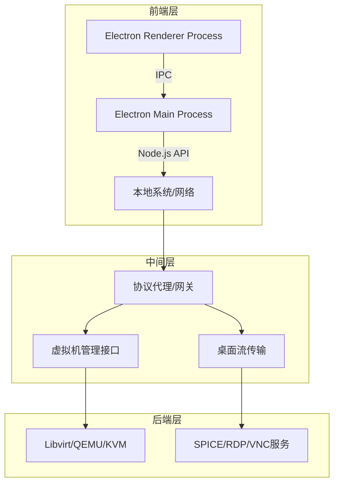

### 前端桌面实现

#### 架构
1. 分层架构

2. 核心组件

| 组件 | 功能 | 推荐开源实现 |
| --- | --- | --- |
| 协议客户端 | 渲染虚拟机桌面流，处理用户输入 | noVNC (VNC)、spice-html5 (SPICE)、FreeRDP (RDP) |
| 虚拟机管理 | 控制虚拟机生命周期（启动/停止/快照） | node-libvirt、qemu-monitor-command (通过 WebSocket) |
| 通信中间件 | 协议转换、安全代理、负载均衡 | Socket.io (WebSocket)、nginx (反向代理)、websockify (VNC/SPICE转WebSocket) |
| 安全层 | 认证、加密、访问控制 | Keycloak (OAuth)、OpenSSL (TLS)、libvirt-sasl |

### 开源实现

#### Electron + SPICE（完整图形桌面）

- 前端：Electron 集成 spice-html5。
- 中间件：websockify 将 SPICE 端口转为 WebSocket。
- 后端：QEMU 启用 SPICE 服务（-spice port=5900,addr=0.0.0.0）。

#### Electron + Libvirt（轻量控制台）
- 前端：Electron + Vue/React UI。
- 中间件：Node.js 调用 libvirt API。
- 后端：Libvirt 守护进程（qemu:///system）。
#### Electron + WebRTC（浏览器兼容）
- 前端：Electron 加载 Apache Guacamole Web 页面。
- 中间件：Guacamole 服务端代理 RDP/VNC。
- 后端：虚拟机启用 RDP/VNC 服务

#### 协议选型对比
| 协议 | 延迟 | 图形质量 | 外设支持 | 适用场景 |
| --- | --- | --- | --- | --- |
| SPICE | 低 | 高（GPU加速） | USB/多显示器/音频 | Linux 图形工作站 |
| RDP | 中 | 高（H.264） | 打印机/剪贴板 | Windows 远程桌面 |
| VNC | 高 | 中等（压缩） | 基础键鼠 | 简单调试/跨平台 |
| WebRTC | 可变 | 高（VP9） | 浏览器受限 | 移动端/零客户端部署 |

#### 完整开源项目参考
1. CloudExplorer Lite

  - 技术栈：Electron + SPICE + Libvirt

  - 功能：轻量级虚拟机管理控制台

  - 源码：https://github.com/yanjunhui/cloud-explorer-lite

2. Remlectron

  - 技术栈：Electron + FreeRDP

  - 功能：Windows 远程桌面客户端

  - 源码：https://github.com/sidneys/remlectron

3. KVM Web Manager

  - 技术栈：Electron + WebSocket + Libvirt

  - 功能：Web 版 KVM 管理工具

  - 源码：https://github.com/Retrospected/kvm-web-manager

#### 扩展方向
- 容器化桌面：集成 KubeVirt 管理 Kubernetes 中的虚拟机。
- AI 辅助：在 Electron 中调用 Tesseract.js 实现虚拟机内文字 OCR。
- 边缘计算：使用 WebRTC 实现 P2P 直连（减少云端中转延迟）。  
