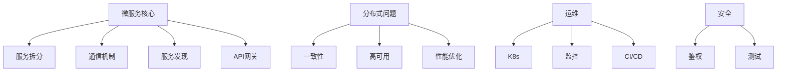

一、面试流程与知识点拆解
1. 基础理论考察
核心问题：

什么是微服务？与单体架构的区别？

微服务的优缺点是什么？

面试题示例：

“为什么选择微服务？哪些场景不适合微服务？”

“如何定义服务的边界？DDD在微服务中的作用？”

2. 技术栈深入
核心领域：

服务通信（RPC/REST/gRPC）

服务发现与注册（Consul/Etcd）

配置管理（ConfigMap/配置中心）

面试题示例：

“gRPC和HTTP REST的性能差异及选型依据？”

“如何实现配置的动态更新？哪些配置必须重启生效？”

3. 架构设计能力
核心问题：

如何设计高可用、可扩展的微服务系统？

容错机制（熔断、降级、重试）的实现。

面试题示例：

“设计一个秒杀系统，如何避免服务雪崩？”

“如何实现跨服务的分布式事务？”

4. 云原生与K8s集成
核心领域：

容器化部署（Docker/K8s）

服务网格（Istio/Linkerd）

可观测性（日志/指标/追踪）

面试题示例：

“K8s中如何保证服务的高可用？”

“Istio的mTLS是如何工作的？如何调试证书问题？”

5. 实战经验考察
核心问题：

实际项目中遇到的微服务难题及解决方案。

性能调优和故障排查经验。

面试题示例：

“描述一次线上微服务故障的排查过程。”

“如何优化微服务间的网络延迟？”

二、分步骤面试准备指南
步骤1：理解基础概念
关键知识点：

微服务的核心特征（松耦合、独立部署等）。

CAP定理在微服务中的权衡。

面试题：

“为什么说微服务更适合云环境？”

“如何理解‘最终一致性’？举例说明。”

步骤2：掌握通信机制
关键知识点：

同步（gRPC）与异步（消息队列）通信的选型。

服务发现的实现方式（客户端/服务端发现）。

面试题：

“Kafka和RabbitMQ在微服务中的适用场景？”

“如何避免服务间循环依赖？”

步骤3：设计容错方案
关键知识点：

熔断（Hystrix/Sentinel）与重试策略（指数退避）。

幂等性设计（唯一ID、数据库约束）。

面试题：

“如何设计一个避免‘重试风暴’的机制？”

“支付服务如何保证幂等性？”

步骤4：熟悉云原生工具链
关键知识点：

K8s的Deployment/Service/Ingress配置。

Istio的流量管理（VirtualService/DestinationRule）。

面试题：

“K8s中如何实现蓝绿发布？”

“Istio的Sidecar注入原理是什么？”

步骤5：准备实战案例
关键知识点：

从项目中提炼架构图、难点和优化点。

熟悉监控工具（Prometheus/Grafana）的使用。

面试题：

“你如何监控微服务的健康状态？”

“如何设计一个可扩展的日志收集系统？”

三、高频深度面试题
1. 系统设计类
“设计一个支持千万级用户的电商平台微服务架构。”

考察点：服务拆分、数据库分片、缓存策略。

“如何实现跨服务的分布式锁？”

考察点：Redis/Etcd/ZooKeeper的实现差异。

2. 故障处理类
“服务A调用服务B超时，如何定位问题？”

考察点：分布式追踪（TraceID）、日志关联。

“如何防止一个服务宕机引发雪崩？”

考察点：熔断器配置、线程池隔离。

3. 性能优化类
“gRPC服务响应慢，如何优化？”

考察点：连接池、压缩算法、负载均衡。

“如何降低微服务间的网络开销？”

考察点：批处理、数据本地化。

4. 安全与治理类
“如何实现微服务的双向认证（mTLS）？”

考察点：证书管理、Istio配置。

“如何管理微服务的API版本兼容性？”

考察点：语义化版本、灰度发布。

四、面试技巧
STAR法则回答问题：

Situation（背景）、Task（任务）、Action（行动）、Result（结果）。

示例：
“我们遇到服务雪崩（S），需要限流（T），引入了Sentinel配置规则（A），错误率下降90%（R）。”

画图辅助说明：

准备架构图（如服务依赖关系）、时序图（如请求流程）。

主动提问：

“贵公司的微服务监控体系是如何建设的？”

“团队如何管理微服务的技术债务？”

