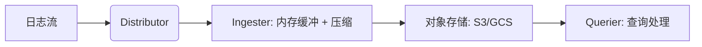
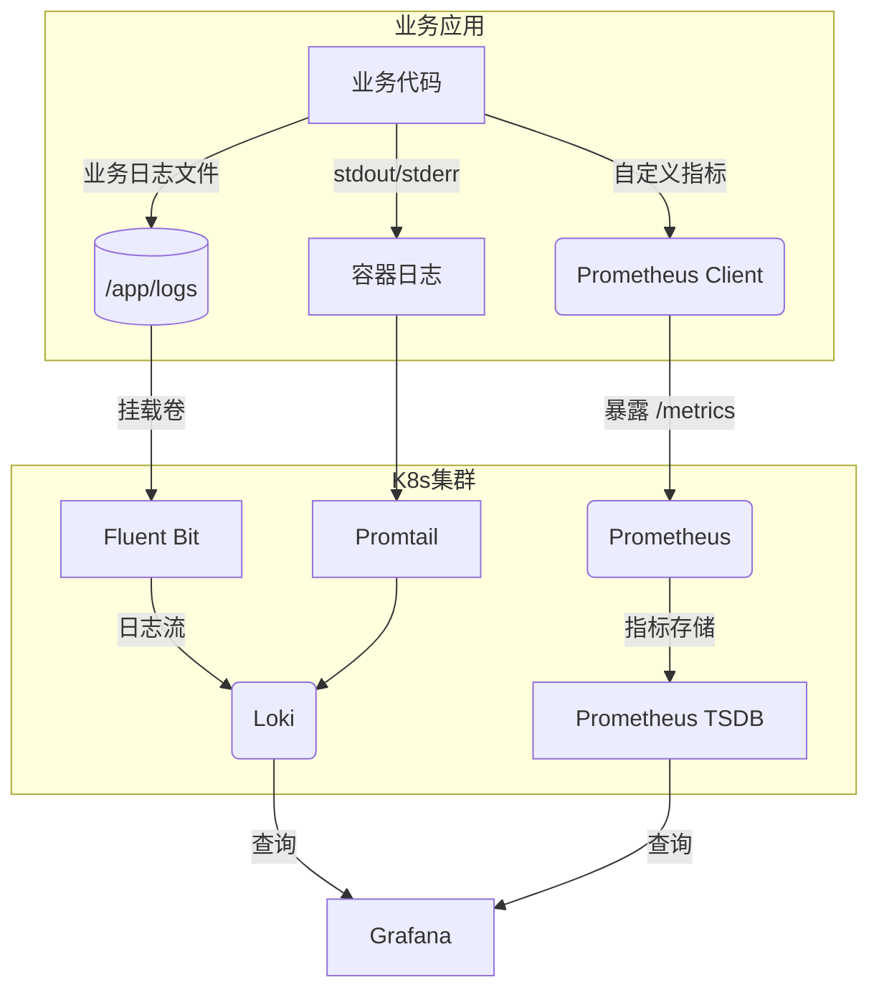
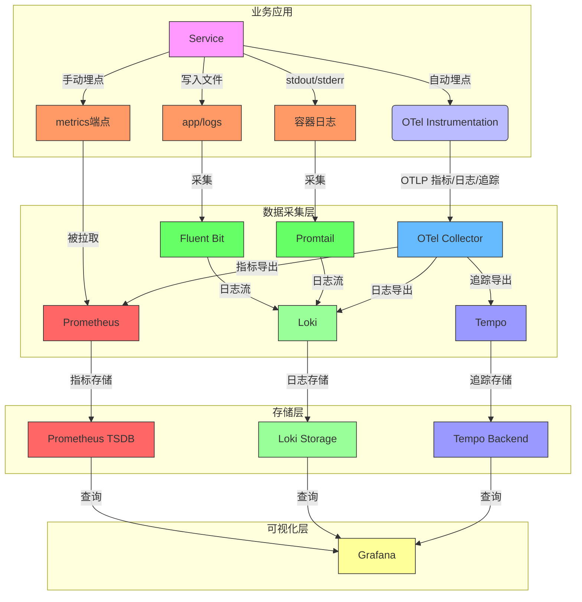
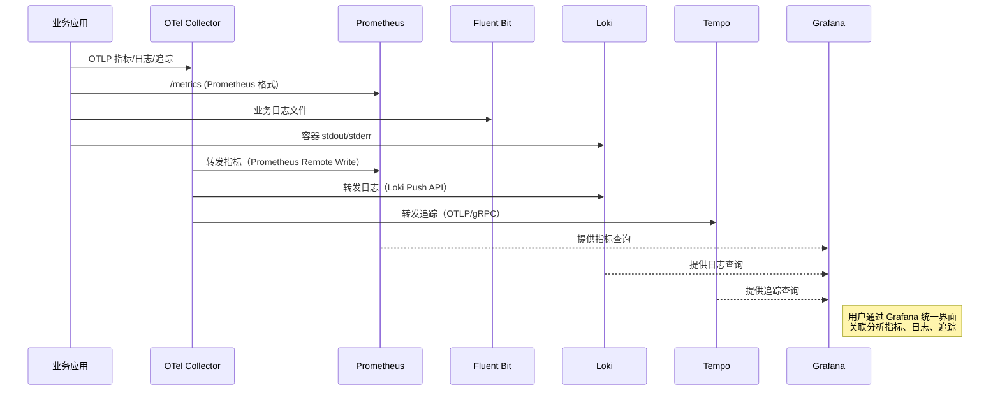
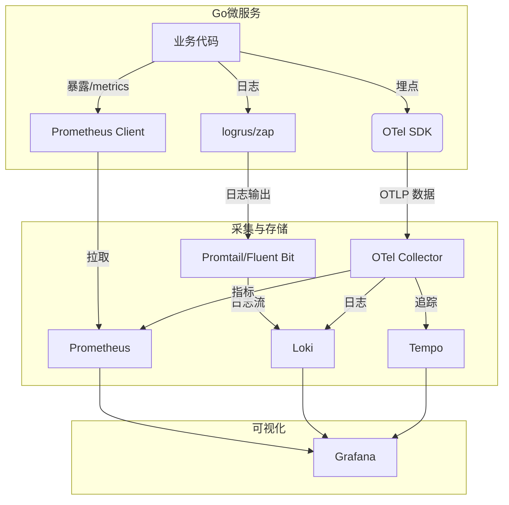
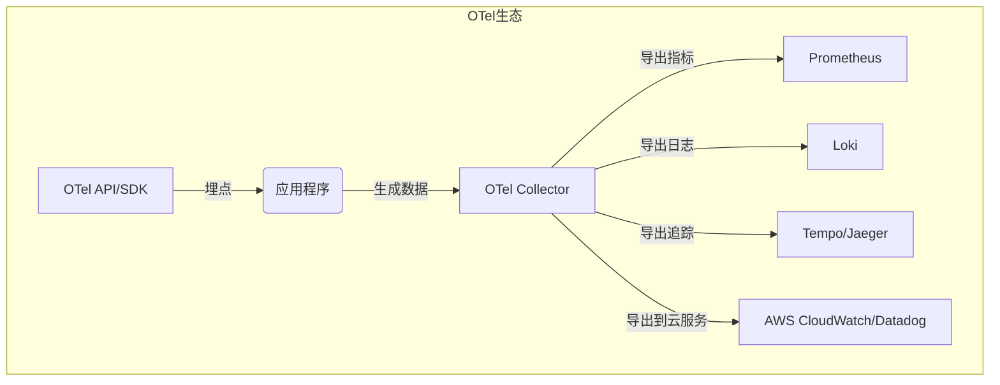
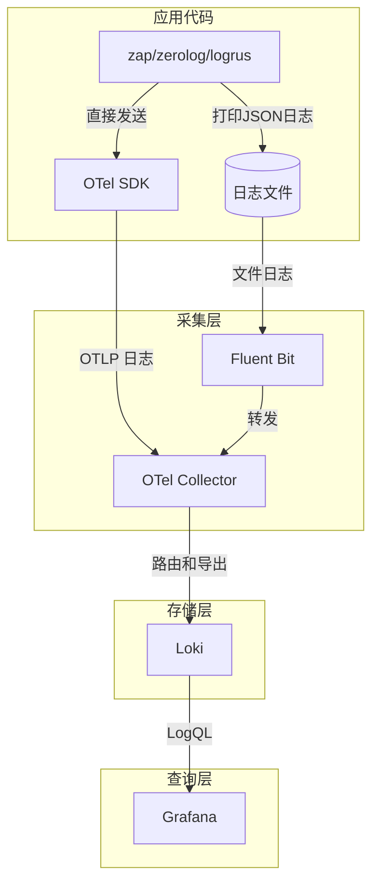
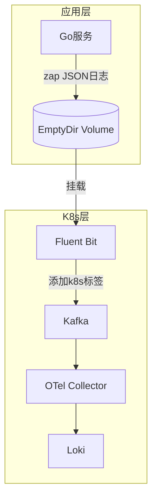

#### prometheus
1. 主动暴露 /metrics
2. 指标转换器exporter
3. 存储使用的自己TSDB
4. 应用 Pod（/metrics） → Prometheus（拉取） → TSDB 存储 → Grafana（PromQL 查询）
#### loki


- 应用 Pod（stdout/stderr） → Promtail（采集+标签） → Loki 存储 → Grafana（LogQL 查询）
### 架构




#### 综合trace后








### 指标、日志、追踪的统一管理


#### 架构


#### 集成方案

1. (1) 指标监控（Prometheus）
   - prometheus client：暴露 Prometheus 指标  /metrics
   - K8s 配置（ServiceMonitor） /metrics
2. (2) 日志收集（Loki） 
   - 结构化日志（logrus）
   - Promtail 配置收集
3. (3) 分布式追踪（Tempo + OpenTelemetry）
   - OTel SDK 埋点（otel.Tracer）
4. (4) 统一采集（OpenTelemetry Collector）
``` yaml
# otel-collector-config.yaml
receivers:
  otlp:
    protocols:
      grpc:
      http:

exporters:
  prometheusremotewrite:
    endpoint: "http://prometheus:9090/api/v1/write"
  loki:
    endpoint: "http://loki:3100/loki/api/v1/push"
  otlp:
    endpoint: "tempo:4317"

service:
  pipelines:
    traces:
      receivers: [otlp]
      exporters: [otlp]
    metrics:
      receivers: [otlp]
      exporters: [prometheusremotewrite]
    logs:
      receivers: [otlp]
      exporters: [loki]
      processors: [batch]
```      
#### 部署编排
1. (1)示例      
``` yaml
# deployment.yaml
apiVersion: apps/v1
kind: Deployment
metadata:
  name: go-service
spec:
  template:
    spec:
      containers:
      - name: go-service
        image: my-go-app:latest
        ports:
        - containerPort: 8080
        env:
        - name: OTEL_SERVICE_NAME
          value: "go-service"
        - name: OTEL_EXPORTER_OTLP_ENDPOINT
          value: "http://otel-collector:4317"
        volumeMounts:
        - name: logs
          mountPath: /var/log/go-service
      volumes:
      - name: logs
        emptyDir: {}
```
2. (2) Sidecar 模式（日志采集）


#### 数据关联与 Grafana 展示
(1) 标签一致性
指标：http_requests_total{service="go-service"}

日志：{job="go-service", trace_id="abc123"}

追踪：tempo_query(trace_id="abc123")

(2) Grafana 仪表盘
指标面板：PromQL 查询 rate(http_requests_total[5m])

日志面板：LogQL 查询 {job="go-service"} |= "error"

追踪面板：直接关联 TraceID





zap/zerolog/logrus 日志生成库（应用层）
OTel Collector	日志收集与路由中枢
Loki	日志存储与查询引擎
Promtail/Fluent Bit	日志采集代理



组件选型建议
|需求|	推荐组合|
|--|--|
|高性能微服务日志|	zap/zerolog + OTel Collector + Loki|
|Kubernetes 环境|	logrus + Promtail + Loki|
|混合环境（VM+K8s）|	zerolog + Fluent Bit + OTel Collector + Loki|
|需要复杂日志分析|	任何日志库 + Elasticsearch（替代 Loki）|


维度	高性能微服务日志	Kubernetes 环境日志
核心目标	极致性能（低延迟、高吞吐）	自动化管理（动态发现、弹性伸缩）
日志来源	业务逻辑高频日志（如每请求多次打印）	容器标准输出（stdout/stderr）+ 少量文件日志
采集挑战	避免日志库成为性能瓶颈	处理 Pod 动态创建销毁的日志流
典型组件	zap/zerolog + OTel Collector + Kafka + Loki	logrus + Promtail + Loki
优化重点	减少内存分配、异步写入	自动标签注入、日志路由

需求	高性能微服务方案	K8s 通用方案
日志分级	代码控制（Debug 日志采样）	采集器过滤（丢弃 Info 级）
多租户隔离	业务标签区分（如 tenant_id）	Loki 的 X-Scope-OrgID
故障排查	依赖 TraceID 跨服务关联	依赖 Pod 名称和事件时间


#### 若服务 既是高性能微服务又运行在 K8s，可融合两者优势

