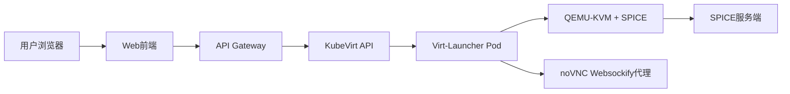

### 前端方案

1. 基于远程桌面协议（RDP/VNC/SPICE）技术栈

|协议|特点|适用场景|开源实现|
|--|--|--|--|
|VNC|简单通用，支持跨平台|基础图形桌面访问	|noVNC（WebSocket代理）|
|RDP|Windows原生支持，高效压缩|Windows虚拟机|xrdp（Linux兼容RDP服务端）|
|SPICE|支持动态分辨率、音频、USB重定向|Linux/KVM虚拟化 |SPICE HTML5（浏览器直接连接）|

2. 云原生集成方案（KubeVirt为例）

3. 代理实现

4. 方案一 Websockify + SPICE HTML5
    1. 配置KubeVirt虚拟机启用SPICE
    2. 在Kubernetes中部署Websockify代理
    3. 前端集成SPICE HTML5客户端

5. 方案二 SPICE Kubernetes Operator（自动化代理）
    1. 部署SPICE Operator
    2. 注解VM启用自动代理
    3. 前端通过Ingress访问Operator暴露的Ingress
    4. 前端集成SPICE Operator提供的Ingress
